<!DOCTYPE html>
<html lang="ru">

<head>
    <meta charset="UTF-8">
    <meta name="viewport" content="width=device-width, initial-scale=1.0">
    <title>Каталог домов</title>
    <link rel="stylesheet" href="css/reset.css">
    <link rel="stylesheet" href="https://cdn.jsdelivr.net/npm/swiper@11/swiper-bundle.min.css" />
    <link rel="stylesheet" href="css/header-desktop.css">
    <link rel="stylesheet" href="css/style.css">
    <link rel="stylesheet" href="css/footer-desctop.css">
    <link rel="stylesheet" href="css/header-moble.css">
    <link rel="stylesheet" href="css/style-mobile.css">
</head>

<body>
    <header class="header header-main header-fixed">
        

            

                

                    <nav class="nav">
                        

                        
                        <ul class="menu">
                            <li class="menu__list menu__link_d">
                                <a href="#" class="menu__link ">
                                    Посёлки
                                 

                                    <svg class="dropdown-icon-villages" width="16" height="16" viewBox="0 0 16 16" fill="none" xmlns="http://www.w3.org/2000/svg">
                                        <path d="M7.76395 10.0972L3.90262 6.23584C3.85592 6.18926 3.82409 6.12987 3.81116 6.06519C3.79823 6.00052 3.80477 5.93346 3.82997 5.8725C3.85516 5.81155 3.89788 5.75944 3.9527 5.72277C4.00752 5.6861 4.07199 5.66652 4.13795 5.6665H11.8619C11.9279 5.66652 11.9924 5.6861 12.0472 5.72277C12.102 5.75944 12.1447 5.81155 12.1699 5.8725C12.1951 5.93346 12.2017 6.00052 12.1887 6.06519C12.1758 6.12987 12.144 6.18926 12.0973 6.23584L8.23528 10.0972C8.17277 10.1597 8.088 10.1948 7.99962 10.1948C7.91123 10.1948 7.82646 10.1597 7.76395 10.0972Z" fill="white"/>
                                    </svg>

                                    
                                        
                                </a>
                                

                                    

                                        

                                            <a class="dropdown-column-villages__link" href="#">
                                                ЖК «Буковая
                                                аллея»</a>
                                            <a class="dropdown-column-villages__link" href="#">
                                                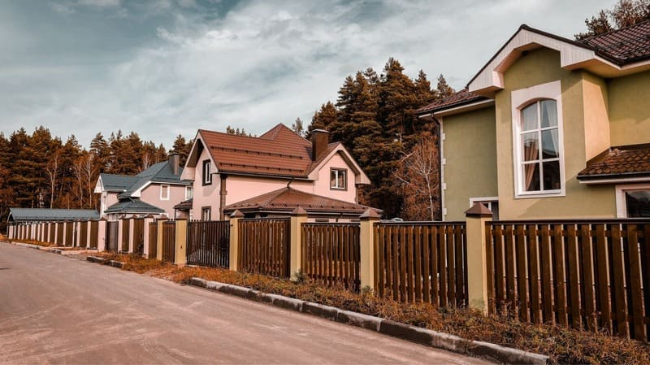ЖК
                                                «Воскресенское»</a>
                                            <a class="dropdown-column-villages__link" href="#">
                                                ЖК «Полесье»</a>
                                        

                                        

                                            <a class="dropdown-column-villages__link" href="#">
                                                ЖК
                                                «Воскресенское-2»</a>
                                            <a class="dropdown-column-villages__link" href="#">
                                                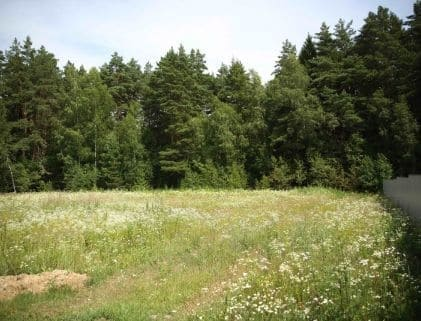КП «Родинки»</a>
                                            <a class="dropdown-column-villages__link" href="#">
                                                ЖК «Новое
                                                Воскресенское»</a>
                                        

                                    

                                
    
                                
                            </li>
                            <li class="menu__list">
                                <a href="#" class="menu__link">Коттеджи</a>
                            </li>
                            <li class="menu__list">
                                <a href="#" class="menu__link">Генплан</a>
                            </li>
                            <li class="menu__list menu__link_d">

                                

                                    

                                        

                                            <a class="dropdown-column-service__link" href="#">
                                                Ипотека
                                            </a>
                                            <a class="dropdown-column-service__link" href="#">
                                                Отделка
                                            </a>
                                            <a class="dropdown-column-service__link" href="#">
                                                Выбор по
                                                параметрам
                                            </a>
                                        

                                    

                                
    

                                <a href="#" class="menu__link">
                                    Сервис
                                   

                                    <svg class="dropdown-icon-service" width="16" height="16" viewBox="0 0 16 16" fill="none" xmlns="http://www.w3.org/2000/svg">
                                        <path d="M7.76395 10.0972L3.90262 6.23584C3.85592 6.18926 3.82409 6.12987 3.81116 6.06519C3.79823 6.00052 3.80477 5.93346 3.82997 5.8725C3.85516 5.81155 3.89788 5.75944 3.9527 5.72277C4.00752 5.6861 4.07199 5.66652 4.13795 5.6665H11.8619C11.9279 5.66652 11.9924 5.6861 12.0472 5.72277C12.102 5.75944 12.1447 5.81155 12.1699 5.8725C12.1951 5.93346 12.2017 6.00052 12.1887 6.06519C12.1758 6.12987 12.144 6.18926 12.0973 6.23584L8.23528 10.0972C8.17277 10.1597 8.088 10.1948 7.99962 10.1948C7.91123 10.1948 7.82646 10.1597 7.76395 10.0972Z" fill="white"/>
                                        </svg>
                                </a>

                                
                            </li>
                            <li class="menu__list">
                                <a href="#" class="menu__link">Контакты</a>
                            </li>
                        </ul>
                    </nav>

                    

                        

                            <a class="phone" href="tel:+74957977071">
                                +7 495 797 70 71
                            </a>
                            <button class="order-call">
                                Заказать звонок
                            </button>
                        

                        
                        

                            <a class="social-link" href="#">
                                

                                    <svg  width="16" height="16" viewBox="0 0 27 26" fill="none" xmlns="http://www.w3.org/2000/svg">
                                        <path d="M0.280273 25.9395L2.10633 19.2738C0.693624 16.8208 0.129607 13.9702 0.501718 11.1641C0.873829 8.35788 2.16127 5.75284 4.16448 3.75278C6.16769 1.75272 8.77475 0.469365 11.5815 0.101665C14.3883 -0.266034 17.2379 0.302464 19.6887 1.71903C22.1395 3.13559 24.0546 5.32109 25.137 7.93671C26.2194 10.5523 26.4087 13.452 25.6755 16.1861C24.9423 18.9203 23.3277 21.3362 21.0818 23.0594C18.836 24.7825 16.0844 25.7167 13.2537 25.717C11.1064 25.7157 8.99362 25.1769 7.108 24.1497L0.280273 25.9395ZM7.41516 21.8279L7.80698 22.0697C9.4546 23.0454 11.334 23.5608 13.2488 23.562C15.6201 23.5625 17.9242 22.7749 19.7991 21.3231C21.6739 19.8713 23.0131 17.8376 23.6062 15.5417C24.1992 13.2458 24.0124 10.8179 23.0752 8.63975C22.138 6.46158 20.5034 4.65665 18.4286 3.50869C16.3537 2.36074 13.9562 1.93487 11.613 2.29803C9.2697 2.6612 7.11357 3.7928 5.48354 5.51495C3.8535 7.23709 2.842 9.45211 2.60806 11.8118C2.37412 14.1715 2.93101 16.542 4.19117 18.5506L4.43303 18.9546L3.3519 22.8993L7.41516 21.8279Z" fill="#005AA3"/>
                                        <path fill-rule="evenodd" clip-rule="evenodd" d="M19.733 15.9117C19.6532 15.7763 19.4379 15.6965 19.1163 15.5369C18.7946 15.3772 17.2152 14.5984 16.9202 14.4896C16.6251 14.3808 16.4123 14.33 16.1946 14.6516C15.9769 14.9733 15.365 15.6965 15.1788 15.9117C14.9925 16.127 14.8015 16.1536 14.4822 15.9916C13.5395 15.613 12.6696 15.0737 11.9112 14.3977C11.2085 13.7477 10.6062 12.997 10.1239 12.1702C9.93524 11.8485 10.1021 11.6864 10.2642 11.5147C10.4262 11.343 10.5858 11.1374 10.7479 10.9512C10.8809 10.789 10.9893 10.608 11.0696 10.4143C11.1119 10.3254 11.1316 10.2275 11.127 10.1291C11.1223 10.0308 11.0935 9.93519 11.043 9.85072C10.9631 9.69109 10.3174 8.10932 10.0513 7.46597C9.78529 6.82262 9.5265 6.92421 9.32575 6.91211C9.12501 6.90002 8.92427 6.91211 8.71143 6.91211C8.54613 6.91484 8.38323 6.9522 8.23326 7.02177C8.08329 7.09134 7.94957 7.19158 7.84073 7.31602C7.48003 7.65802 7.19394 8.0709 7.0004 8.52873C6.80686 8.98656 6.71007 9.47946 6.71608 9.97648C6.71608 11.5583 7.86734 13.0868 8.02938 13.3021C8.19143 13.5173 10.2956 16.7631 13.5196 18.1538C14.1182 18.4121 14.7302 18.6381 15.3529 18.831C16.0086 19.0301 16.7017 19.074 17.3773 18.9592C17.994 18.8673 19.2783 18.1804 19.554 17.4306C19.8297 16.6809 19.8128 16.0448 19.733 15.9117Z" fill="#005AA3"/>
                                    </svg>
                                

                            </a>
                            <a class="social-link" href="#">
                                

                                    <svg width="28" height="28" viewBox="0 0 30 30" fill="none" xmlns="http://www.w3.org/2000/svg">
                                        <g clip-path="url(#clip0_56_1212)">
                                        <path fill-rule="evenodd" clip-rule="evenodd" d="M6.88042 14.7417C11.2423 12.8412 14.1507 11.5882 15.6055 10.9826C19.7609 9.2552 20.6288 8.9552 21.1869 8.94403C21.3939 8.94001 21.5969 9.00101 21.7674 9.11845C21.887 9.2216 21.9633 9.36613 21.9809 9.5231C22.0109 9.71833 22.0194 9.91627 22.006 10.1133C21.7814 12.4854 20.806 18.2189 20.3107 20.8687C20.1014 21.985 19.6883 22.3659 19.2879 22.4036C18.42 22.4831 17.753 21.8287 16.9158 21.2775C15.5986 20.4138 14.8548 19.8822 13.5767 19.0338C12.099 18.0571 13.0576 17.5254 13.899 16.6519C14.1195 16.4231 17.9455 12.9403 18.0209 12.625C18.0308 12.5784 18.0297 12.5301 18.0176 12.4841C18.0054 12.4381 17.9827 12.3955 17.9511 12.3598C17.9053 12.3312 17.8535 12.3137 17.7997 12.3086C17.7459 12.3035 17.6917 12.311 17.6414 12.3305C17.5102 12.3594 15.4069 13.7496 11.3316 16.5012C10.7344 16.9115 10.1934 17.1115 9.7088 17.1012C9.17438 17.0887 8.14739 16.7985 7.38274 16.5431C6.44646 16.2389 5.70833 16.0785 5.76694 15.5664C5.80135 15.2985 6.17251 15.0236 6.88042 14.7417Z" fill="white"/>
                                        </g>
                                        <defs>
                                        <clipPath id="clip0_56_1212">
                                        <rect width="30" height="30" fill="white"/>
                                        </clipPath>
                                        </defs>
                                        </svg>
                                        
                                

                            </a>
                            <button class="social-like" href="#">
                                

                                    <svg class="social-icon-svg" width="24" height="24" viewBox="0 0 24 24" fill="none" xmlns="http://www.w3.org/2000/svg">
                                        <path d="M11.9998 19.7503C11.801 19.7501 11.6103 19.671 11.4698 19.5303L4.6998 12.7403C3.78366 11.8056 3.27051 10.549 3.27051 9.2403C3.27051 7.93154 3.78366 6.67494 4.6998 5.7403C5.62809 4.8121 6.88706 4.29066 8.1998 4.29066C9.51253 4.29066 10.7715 4.8121 11.6998 5.7403L11.9998 6.0003L12.2798 5.7203C12.7388 5.2563 13.2855 4.88825 13.8881 4.6376C14.4907 4.38694 15.1372 4.25869 15.7898 4.2603C16.4418 4.25738 17.0878 4.38406 17.6904 4.63298C18.2929 4.88191 18.84 5.2481 19.2998 5.7103C20.2159 6.64494 20.7291 7.90154 20.7291 9.2103C20.7291 10.519 20.2159 11.7756 19.2998 12.7103L12.5298 19.5003C12.4628 19.5754 12.3813 19.6362 12.2902 19.6792C12.1992 19.7221 12.1004 19.7463 11.9998 19.7503ZM8.2098 5.7503C7.75563 5.74699 7.3053 5.83366 6.88479 6.00529C6.46429 6.17693 6.08194 6.43013 5.7598 6.7503C5.11067 7.40245 4.74625 8.28515 4.74625 9.2053C4.74625 10.1254 5.11067 11.0081 5.7598 11.6603L11.9998 17.9403L18.2298 11.6803C18.5524 11.358 18.8084 10.9753 18.983 10.554C19.1576 10.1328 19.2475 9.68131 19.2475 9.2253C19.2475 8.76929 19.1576 8.31776 18.983 7.89651C18.8084 7.47527 18.5524 7.09257 18.2298 6.7703C17.9102 6.44953 17.5297 6.19584 17.1107 6.02411C16.6917 5.85239 16.2426 5.7661 15.7898 5.7703C15.3356 5.76699 14.8853 5.85366 14.4648 6.02529C14.0443 6.19693 13.6619 6.45013 13.3398 6.7703L12.5298 7.5803C12.3867 7.71605 12.197 7.79173 11.9998 7.79173C11.8026 7.79173 11.6129 7.71605 11.4698 7.5803L10.6598 6.7703C10.3393 6.44652 9.9577 6.18963 9.53712 6.01453C9.11654 5.83943 8.66537 5.74961 8.2098 5.7503Z" fill="#005AA3"/>
                                        </svg>
                                        
                                

                                3
                            </button>
                            <button class="phone-mobile">
                                
                                <svg width="16" height="16" viewBox="0 0 16 16" fill="none" xmlns="http://www.w3.org/2000/svg">
                                    <path d="M1.33693 3.02794C1.26967 2.07507 2.07655 1.3335 3.02982 1.3335H5.07038C5.55971 1.3335 6.00105 1.62834 6.18926 2.08096L7.04254 4.13314C7.2504 4.63304 7.10287 5.21046 6.68087 5.54878L6.14896 5.97519C5.91159 6.16548 5.83089 6.49362 5.97163 6.76336C6.69494 8.14956 7.76394 9.32603 9.06394 10.178C9.33834 10.3578 9.7008 10.2862 9.90554 10.0298L10.4598 9.3355C10.7974 8.91263 11.3736 8.76483 11.8725 8.9731L13.9204 9.82816C14.3721 10.0168 14.6663 10.459 14.6663 10.9494V13.0002C14.6663 13.9554 13.8989 14.7305 12.9481 14.6629C6.86774 14.2303 1.76799 9.13463 1.33693 3.02794Z" fill="white"/>
                                </svg>
                                    
                            </button>
                            <button class="menu__btn">
                                <svg width="20" height="20" viewBox="0 0 20 20" fill="none" xmlns="http://www.w3.org/2000/svg">
                                    <path d="M3.33301 6.6665H16.6663M3.33301 13.3332H16.6663" stroke="white" stroke-width="2" stroke-linecap="round" stroke-linejoin="round"/>
                                    </svg>
                                    
                            </button>
                        

                        

                            

                                

                                    
Избранное:

                                    
                                    <button class="popup-close" id="popup-close">
                                        
Закрыть

                                        
                                    </button>
                                

                                
Избранное:

                                

                                    

                                        
                                        

                                            
Мюнхен (участок №116)

                                            <a class="favorite-details__mapteg" href="#">
                                                
                                                
ЖК «Воскресенское-2»

                                            </a>
                                            
от 10 000 000 ₽

                                        

                                        <button class="remove-favorite">
                                            
                                        </button>
                                    

                                    

                                        
                                        

                                            
Будапешт (участок №119)

                                            <a class="favorite-details__mapteg" href="#">
                                                
                                                
ЖК «Воскресенское-2»

                                            </a>
                                            
от 15 000 000 ₽

                                        

                                        <button class="remove-favorite">
                                            
                                        </button>
                                    

                                    

                                        
                                        

                                            
Неаполь (участок №112)

                                            <a class="favorite-details__mapteg" href="#">
                                                
                                                
ЖК «Воскресенское-2»

                                            </a>
                                            
от 20 000 000 ₽

                                        

                                        <button class="remove-favorite">
                                            
                                        </button>
                                    

                                

                            

                        

                        

                            

                                

                                    
                                    <button class="popup-close" id="popup-close-menu">
                                        
Закрыть

                                        
                                    </button>
                                

                                

                                    <nav class="menu-mobile__nav">
                                        <ul class="menu-mobile__list">
                                            <li class="menu-mobile__list-item">
                                                <a class="menu-mobile__list-link" href="#">Главная</a>
                                            </li>
                                            <li class="menu-mobile__list-item">
                                                <a class="menu-mobile__list-link" href="#">Посёлки
                                                    

                                                        <svg class="dropdown-icon-villages-mob" width="16" height="16" viewBox="0 0 16 16" fill="none" xmlns="http://www.w3.org/2000/svg">
                                                            <path d="M7.76395 10.0972L3.90262 6.23584C3.85592 6.18926 3.82409 6.12987 3.81116 6.06519C3.79823 6.00052 3.80477 5.93346 3.82997 5.8725C3.85516 5.81155 3.89788 5.75944 3.9527 5.72277C4.00752 5.6861 4.07199 5.66652 4.13795 5.6665H11.8619C11.9279 5.66652 11.9924 5.6861 12.0472 5.72277C12.102 5.75944 12.1447 5.81155 12.1699 5.8725C12.1951 5.93346 12.2017 6.00052 12.1887 6.06519C12.1758 6.12987 12.144 6.18926 12.0973 6.23584L8.23528 10.0972C8.17277 10.1597 8.088 10.1948 7.99962 10.1948C7.91123 10.1948 7.82646 10.1597 7.76395 10.0972Z" fill="white"/>
                                                        </svg>
                                                            
                                                </a>
                                                

                                                    <a class="dropdown-column-villages__link-mob" href="#">Новое
                                                        Воскресенское</a>
                                                    <a class="dropdown-column-villages__link-mob"
                                                        href="#">Воскресенское-2</a>
                                                    <a class="dropdown-column-villages__link-mob"
                                                        href="#">Воскресенское</a>
                                                    <a class="dropdown-column-villages__link-mob" href="#">Буковая
                                                        аллея</a>
                                                    <a class="dropdown-column-villages__link-mob" href="#">Полесье</a>
                                                    <a class="dropdown-column-villages__link-mob" href="#">Родинки</a>
                                                

                                            </li>
                                            <li class="menu-mobile__list-item">
                                                <a class="menu-mobile__list-link" href="#">Коттеджи</a>
                                            </li>
                                            <li class="menu-mobile__list-item">
                                                <a class="menu-mobile__list-link" href="#">Генплан</a>
                                            </li>
                                            <li class="menu-mobile__list-item">
                                                <a class="menu-mobile__list-link" href="#">Сервис
                                                    
                                                </a>
                                                

                                                    <a class="dropdown-column-villages__link-mob" href="#">Ипотека</a>
                                                    <a class="dropdown-column-villages__link-mob" href="#">Отделка</a>
                                                    <a class="dropdown-column-villages__link-mob" href="#">Выбор по
                                                        параметрам</a>
                                                

                                            </li>
                                            <li class="menu-mobile__list-item">
                                                <a class="menu-mobile__list-link" href="#">Контакты</a>
                                            </li>
                                        </ul>
                                    </nav>

                                    

                                        <a class="connect" href="tel:+74957977071">
                                            +7 (495) 797 70 71
                                        </a>
                                        

                                            Ежедневно с 10 до 19
                                        

                                    

                                    

                                        <a class="contacts__social-link-mob" href="#">
                                            
                                        </a>
                                        <a class="contacts__social-link-mob" href="#">
                                            
                                        </a>
                                        <a class="contacts__social-link-mob" href="#">
                                            
                                        </a>
                                        <a class="contacts__social-link-mob" href="#">
                                            
                                        </a>
                                    

                                

                            

                        

                    

                

            

            

                <ul class="crumbs">
                    <li><a href="#">Главная </a></li>
                    <li><a href="#" class="active">Коттеджи</a></li>
                </ul>
            

        

    </header>

    

        

            <h2 class="section-title header-cover_catalog_title">Наши коттеджи</h2>
            

                Жилые готовые дома и проекты домов, 
                выдержаные в едином архитектурном стиле
            

            

                <a class="header-teg" href="#">
                    
                    
МО

                </a>
                <a class="header-teg" href="#">
                    
                    
Богородский городской округ

                </a>
                <a class="header-teg" href="#">
                    
                    
Щелковское шоссе

                </a>
                <a class="header-teg" href="#">
                    
                    
Горьковское шоссе

                </a>
            

        
    
    

    <main class="main main__inner">

        <!-- Cottages -->
        <section class="cottages catalogHome-cottages">
            

                

                    <button class="cottages__nav-btn active" id="cottages-btn1">
                        Построенные
                    </button>
                    <button class="cottages__nav-btn" id="cottages-btn2">
                        Проекты домов
                    </button>
                

                

                    

                        

                            

                                

                                    

                                        

                                            

                                                

                                                    

                                                        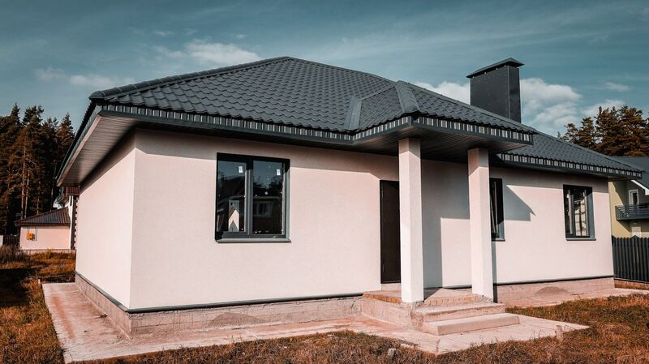
                                                    

                                                    

                                                        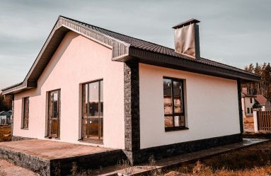
                                                    

                                                    

                                                        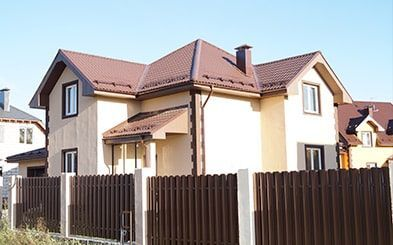
                                                    

                                                    

                                                        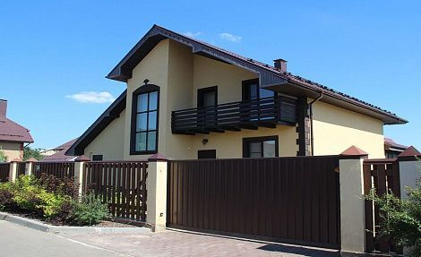
                                                    

                                                    

                                                        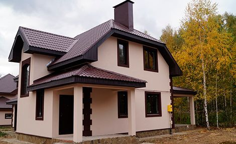
                                                    

                                                

                                                

                                            

                                            

                                                

                                                    

                                                        <a href="#">Мюнхен (участок №116)</a>
                                                    

                                                    

                                                        
                                                        <a class="built-cottage__gk" href="">ЖК «Воскресенское-2»</a>
                                                    

                                                    
от 10 000 000 ₽

                                                

                                                

                                                    

                                                        
Комнат:

                                                        
2

                                                    

                                                    

                                                        
Санузлов:

                                                        
1

                                                    

                                                    

                                                        
Этажей:

                                                        
1

                                                    

                                                    

                                                        
Площадь:

                                                        
102 м²

                                                    

                                                

                                            

                                            

                                                
-15%

                                                

                                                    <button class="house-icon__btn">
                                                        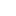
                                                    </button>
                                                    <button class="house-icon__btn">
                                                        
                                                    </button>
                                                

                                            

                                        

                                        

                                            

                                                

                                                    

                                                        
                                                    

                                                    

                                                        
                                                    

                                                    

                                                        
                                                    

                                                    

                                                        
                                                    

                                                    

                                                        
                                                    

                                                

                                                

                                            

                                            

                                                

                                                    

                                                        <a href="#">Будапешт (участок №119)</a>
                                                    

                                                    

                                                        
                                                        <a class="built-cottage__gk" href="">ЖК «Воскресенское-2»</a>
                                                    

                                                    
от 15 000 000 ₽

                                                

                                                

                                                    

                                                        
Комнат:

                                                        
3

                                                    

                                                    

                                                        
Санузлов:

                                                        
1

                                                    

                                                    

                                                        
Этажей:

                                                        
1

                                                    

                                                    

                                                        
Площадь:

                                                        
141 м²

                                                    

                                                

                                            

                                            

                                                
-15%

                                                

                                                    <button class="house-icon__btn">
                                                        
                                                    </button>
                                                    <button class="house-icon__btn">
                                                        
                                                    </button>
                                                

                                            

                                        

                                        

                                            

                                                

                                                    

                                                        
                                                    

                                                    

                                                        
                                                    

                                                    

                                                        
                                                    

                                                    

                                                        
                                                    

                                                    

                                                        
                                                    

                                                

                                                

                                            

                                            

                                                

                                                    

                                                        <a href="#">Неаполь (участок №112)</a>
                                                    

                                                    

                                                        
                                                        <a class="built-cottage__gk" href="">ЖК «Воскресенское-2»</a>
                                                    

                                                    
от 20 000 000 ₽

                                                

                                                

                                                    

                                                        
Комнат:

                                                        
4

                                                    

                                                    

                                                        
Санузлов:

                                                        
2

                                                    

                                                    

                                                        
Этажей:

                                                        
2

                                                    

                                                    

                                                        
Площадь:

                                                        
173 м²

                                                    

                                                

                                            

                                            

                                                
-15%

                                                

                                                    <button class="house-icon__btn">
                                                        
                                                    </button>
                                                    <button class="house-icon__btn">
                                                        
                                                    </button>
                                                

                                            

                                        

                                        

                                            

                                                

                                                    

                                                        
                                                    

                                                    

                                                        
                                                    

                                                    

                                                        
                                                    

                                                    

                                                        
                                                    

                                                    

                                                        
                                                    

                                                

                                                

                                            

                                            

                                                

                                                    

                                                        <a href="#">Бавария (участок №111)</a>
                                                    

                                                    

                                                        
                                                        <a class="built-cottage__gk" href="">ЖК «Воскресенское-2»</a>
                                                    

                                                    
от 25 000 000 ₽

                                                

                                                

                                                    

                                                        
Комнат:

                                                        
4

                                                    

                                                    

                                                        
Санузлов:

                                                        
2

                                                    

                                                    

                                                        
Этажей:

                                                        
2

                                                    

                                                    

                                                        
Площадь:

                                                        
210 м²

                                                    

                                                

                                            

                                            

                                                
-15%

                                                

                                                    <button class="house-icon__btn">
                                                        
                                                    </button>
                                                    <button class="house-icon__btn">
                                                        
                                                    </button>
                                                

                                            

                                        

                                        

                                            

                                                

                                                    

                                                        
                                                    

                                                    

                                                        
                                                    

                                                    

                                                        
                                                    

                                                    

                                                        
                                                    

                                                    

                                                        
                                                    

                                                

                                                

                                            

                                            

                                                

                                                    

                                                        <a href="#">Корсика Small (участок №6)</a>
                                                    

                                                    

                                                        
                                                        <a class="built-cottage__gk" href="">ЖК «Воскресенское-2»</a>
                                                    

                                                    
от 30 000 000 ₽

                                                

                                                

                                                    

                                                        
Комнат:

                                                        
2

                                                    

                                                    

                                                        
Санузлов:

                                                        
1

                                                    

                                                    

                                                        
Этажей:

                                                        
1

                                                    

                                                    

                                                        
Площадь:

                                                        
102 м²

                                                    

                                                

                                            

                                            

                                                
-15%

                                                

                                                    <button class="house-icon__btn">
                                                        
                                                    </button>
                                                    <button class="house-icon__btn">
                                                        
                                                    </button>
                                                

                                            

                                        

                                        

                                            

                                                

                                                    

                                                        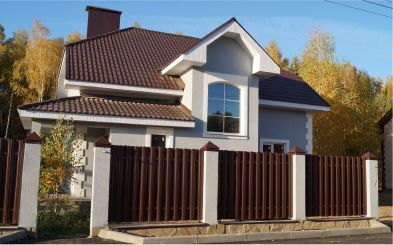
                                                    

                                                    

                                                        
                                                    

                                                    

                                                        
                                                    

                                                    

                                                        
                                                    

                                                    

                                                        
                                                    

                                                

                                                

                                            

                                            

                                                

                                                    

                                                        <a href="#">Корсика (участок №231)</a>
                                                    

                                                    

                                                        
                                                        <a class="built-cottage__gk" href="">ЖК «Воскресенское-2»</a>
                                                    

                                                    
от 35 000 000 ₽

                                                

                                                

                                                    

                                                        
Комнат:

                                                        
3

                                                    

                                                    

                                                        
Санузлов:

                                                        
1

                                                    

                                                    

                                                        
Этажей:

                                                        
1

                                                    

                                                    

                                                        
Площадь:

                                                        
141 м²

                                                    

                                                

                                            

                                            

                                                
-15%

                                                

                                                    <button class="house-icon__btn">
                                                        
                                                    </button>
                                                    <button class="house-icon__btn">
                                                        
                                                    </button>
                                                

                                            

                                        

                                        

                                            

                                                

                                                    

                                                        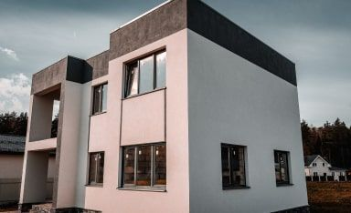
                                                    

                                                    

                                                        
                                                    

                                                    

                                                        
                                                    

                                                    

                                                        
                                                    

                                                    

                                                        
                                                    

                                                

                                                

                                            

                                            

                                                

                                                    

                                                        <a href="#">Кёльн (участок №137)</a>
                                                    

                                                    

                                                        
                                                        <a class="built-cottage__gk" href="">ЖК «Воскресенское-2»</a>
                                                    

                                                    
от 40 000 000 ₽

                                                

                                                

                                                    

                                                        
Комнат:

                                                        
4

                                                    

                                                    

                                                        
Санузлов:

                                                        
3

                                                    

                                                    

                                                        
Этажей:

                                                        
3

                                                    

                                                    

                                                        
Площадь:

                                                        
143 м²

                                                    

                                                

                                            

                                            

                                                
-15%

                                                

                                                    <button class="house-icon__btn">
                                                        
                                                    </button>
                                                    <button class="house-icon__btn">
                                                        
                                                    </button>
                                                

                                            

                                        

                                        

                                            

                                                

                                                    

                                                        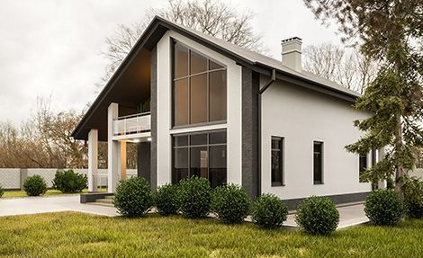
                                                    

                                                    

                                                        
                                                    

                                                    

                                                        
                                                    

                                                    

                                                        
                                                    

                                                    

                                                        
                                                    

                                                

                                                

                                            

                                            

                                                

                                                    

                                                        <a href="#">Будапешт (участок №119)</a>
                                                    

                                                    

                                                        
                                                        <a class="built-cottage__gk" href="">ЖК «Воскресенское-2»</a>
                                                    

                                                    
от 45 000 000 ₽

                                                

                                                

                                                    

                                                        
Комнат:

                                                        
4

                                                    

                                                    

                                                        
Санузлов:

                                                        
3

                                                    

                                                    

                                                        
Этажей:

                                                        
3

                                                    

                                                    

                                                        
Площадь:

                                                        
250 м²

                                                    

                                                

                                            

                                            

                                                
-15%

                                                

                                                    <button class="house-icon__btn">
                                                        
                                                    </button>
                                                    <button class="house-icon__btn">
                                                        
                                                    </button>
                                                

                                            

                                        

                                    

                                

                                

                                    

                                        

                                            

                                                

                                                    

                                                        
                                                    

                                                    

                                                        
                                                    

                                                    

                                                        
                                                    

                                                    

                                                        
                                                    

                                                    

                                                        
                                                    

                                                

                                                

                                            

                                            

                                                

                                                    

                                                        <a href="#">Мюнхен (участок №116)</a>
                                                    

                                                    

                                                        
                                                        <a class="built-cottage__gk" href="">ЖК «Воскресенское-2»</a>
                                                    

                                                    
от 10 000 000 ₽

                                                

                                                

                                                    

                                                        
Комнат:

                                                        
2

                                                    

                                                    

                                                        
Санузлов:

                                                        
1

                                                    

                                                    

                                                        
Этажей:

                                                        
1

                                                    

                                                    

                                                        
Площадь:

                                                        
102 м²

                                                    

                                                

                                            

                                            

                                                
-15%

                                                

                                                    <button class="house-icon__btn">
                                                        
                                                    </button>
                                                    <button class="house-icon__btn">
                                                        
                                                    </button>
                                                

                                            

                                        

                                    

                                

                                

                                    

                                        Slide 3
                                    

                                

                                

                                    

                                        Slide 4
                                    

                                

                                

                                    

                                        Slide 5
                                    

                                

                                

                                    

                                        Slide 6
                                    

                                

                            

                            

                            

                                
                            

                            

                                
                            

                        

                        <a class="privileges__link" href="#">
                            Смотреть все
                            
                        </a>
                    

                    

                        

                            

                                

                                    

                                        

                                            

                                                

                                                    

                                                        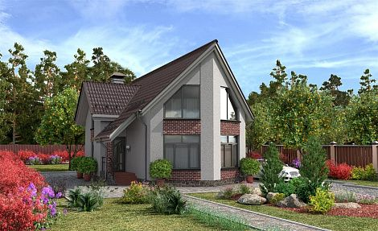
                                                    

                                                    

                                                        
                                                    

                                                    

                                                        
                                                    

                                                    

                                                        
                                                    

                                                    

                                                        
                                                    

                                                

                                                

                                            

                                            

                                                

                                                    

                                                        <a href="#">Флоренция Small</a>
                                                    

                                                    

                                                        Построим на выбраном вами участке
                                                    

                                                    
от 10 000 000 ₽

                                                

                                                

                                                    

                                                        
Комнат:

                                                        
2

                                                    

                                                    

                                                        
Санузлов:

                                                        
1

                                                    

                                                    

                                                        
Этажей:

                                                        
1

                                                    

                                                    

                                                        
Площадь:

                                                        
102 м²

                                                    

                                                

                                            

                                            

                                                
Проект дома

                                                

                                                    <button class="house-icon__btn">
                                                        
                                                    </button>
                                                    <button class="house-icon__btn">
                                                        
                                                    </button>
                                                

                                            

                                        

                                        

                                            

                                                

                                                    

                                                        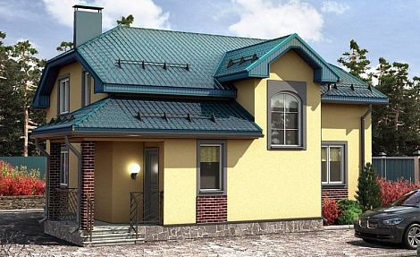
                                                    

                                                    

                                                        
                                                    

                                                    

                                                        
                                                    

                                                    

                                                        
                                                    

                                                    

                                                        
                                                    

                                                

                                                

                                            

                                            

                                                

                                                    

                                                        <a href="#">Флоренция Small</a>
                                                    

                                                    

                                                        Построим на выбраном вами участке
                                                    

                                                    
от 10 000 000 ₽

                                                

                                                

                                                    

                                                        
Комнат:

                                                        
2

                                                    

                                                    

                                                        
Санузлов:

                                                        
1

                                                    

                                                    

                                                        
Этажей:

                                                        
1

                                                    

                                                    

                                                        
Площадь:

                                                        
102 м²

                                                    

                                                

                                            

                                            

                                                
Проект дома

                                                

                                                    <button class="house-icon__btn">
                                                        
                                                    </button>
                                                    <button class="house-icon__btn">
                                                        
                                                    </button>
                                                

                                            

                                        

                                        

                                            

                                                

                                                    

                                                        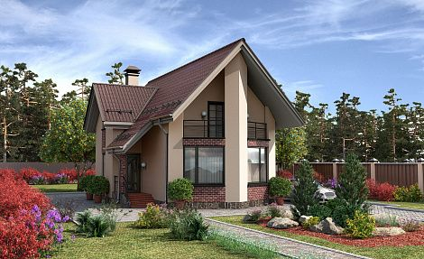
                                                    

                                                    

                                                        
                                                    

                                                    

                                                        
                                                    

                                                    

                                                        
                                                    

                                                    

                                                        
                                                    

                                                

                                                

                                            

                                            

                                                

                                                    

                                                        <a href="#">Флоренция Small</a>
                                                    

                                                    

                                                        Построим на выбраном вами участке
                                                    

                                                    
от 10 000 000 ₽

                                                

                                                

                                                    

                                                        
Комнат:

                                                        
2

                                                    

                                                    

                                                        
Санузлов:

                                                        
1

                                                    

                                                    

                                                        
Этажей:

                                                        
1

                                                    

                                                    

                                                        
Площадь:

                                                        
102 м²

                                                    

                                                

                                            

                                            

                                                
Проект дома

                                                

                                                    <button class="house-icon__btn">
                                                        
                                                    </button>
                                                    <button class="house-icon__btn">
                                                        
                                                    </button>
                                                

                                            

                                        

                                        

                                            

                                                

                                                    

                                                        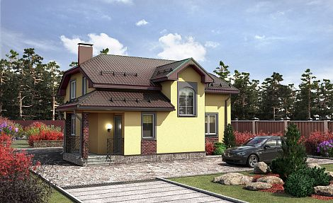
                                                    

                                                    

                                                        
                                                    

                                                    

                                                        
                                                    

                                                    

                                                        
                                                    

                                                    

                                                        
                                                    

                                                

                                                

                                            

                                            

                                                

                                                    

                                                        <a href="#">Флоренция Small</a>
                                                    

                                                    

                                                        Построим на выбраном вами участке
                                                    

                                                    
от 10 000 000 ₽

                                                

                                                

                                                    

                                                        
Комнат:

                                                        
2

                                                    

                                                    

                                                        
Санузлов:

                                                        
1

                                                    

                                                    

                                                        
Этажей:

                                                        
1

                                                    

                                                    

                                                        
Площадь:

                                                        
102 м²

                                                    

                                                

                                            

                                            

                                                
Проект дома

                                                

                                                    <button class="house-icon__btn">
                                                        
                                                    </button>
                                                    <button class="house-icon__btn">
                                                        
                                                    </button>
                                                

                                            

                                        

                                        

                                            

                                                

                                                    

                                                        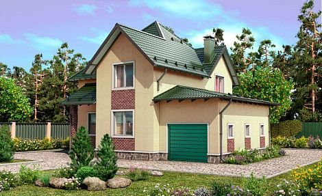
                                                    

                                                    

                                                        
                                                    

                                                    

                                                        
                                                    

                                                    

                                                        
                                                    

                                                    

                                                        
                                                    

                                                

                                                

                                            

                                            

                                                

                                                    

                                                        <a href="#">Флоренция Small</a>
                                                    

                                                    

                                                        Построим на выбраном вами участке
                                                    

                                                    
от 10 000 000 ₽

                                                

                                                

                                                    

                                                        
Комнат:

                                                        
2

                                                    

                                                    

                                                        
Санузлов:

                                                        
1

                                                    

                                                    

                                                        
Этажей:

                                                        
1

                                                    

                                                    

                                                        
Площадь:

                                                        
102 м²

                                                    

                                                

                                            

                                            

                                                
Проект дома

                                                

                                                    <button class="house-icon__btn">
                                                        
                                                    </button>
                                                    <button class="house-icon__btn">
                                                        
                                                    </button>
                                                

                                            

                                        

                                        

                                            

                                                

                                                    

                                                        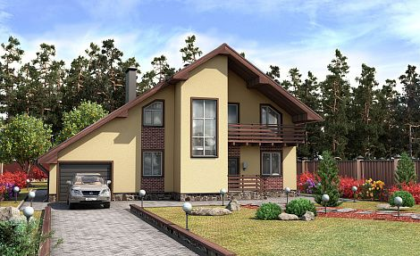
                                                    

                                                    

                                                        
                                                    

                                                    

                                                        
                                                    

                                                    

                                                        
                                                    

                                                    

                                                        
                                                    

                                                

                                                

                                            

                                            

                                                

                                                    

                                                        <a href="#">Флоренция Small</a>
                                                    

                                                    

                                                        Построим на выбраном вами участке
                                                    

                                                    
от 10 000 000 ₽

                                                

                                                

                                                    

                                                        
Комнат:

                                                        
2

                                                    

                                                    

                                                        
Санузлов:

                                                        
1

                                                    

                                                    

                                                        
Этажей:

                                                        
1

                                                    

                                                    

                                                        
Площадь:

                                                        
102 м²

                                                    

                                                

                                            

                                            

                                                
Проект дома

                                                

                                                    <button class="house-icon__btn">
                                                        
                                                    </button>
                                                    <button class="house-icon__btn">
                                                        
                                                    </button>
                                                

                                            

                                        

                                        

                                            

                                                

                                                    

                                                        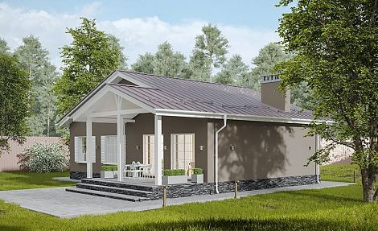
                                                    

                                                    

                                                        
                                                    

                                                    

                                                        
                                                    

                                                    

                                                        
                                                    

                                                    

                                                        
                                                    

                                                

                                                

                                            

                                            

                                                

                                                    

                                                        <a href="#">Флоренция Small</a>
                                                    

                                                    

                                                        Построим на выбраном вами участке
                                                    

                                                    
от 10 000 000 ₽

                                                

                                                

                                                    

                                                        
Комнат:

                                                        
2

                                                    

                                                    

                                                        
Санузлов:

                                                        
1

                                                    

                                                    

                                                        
Этажей:

                                                        
1

                                                    

                                                    

                                                        
Площадь:

                                                        
102 м²

                                                    

                                                

                                            

                                            

                                                
Проект дома

                                                

                                                    <button class="house-icon__btn">
                                                        
                                                    </button>
                                                    <button class="house-icon__btn">
                                                        
                                                    </button>
                                                

                                            

                                        

                                        

                                            

                                                

                                                    

                                                        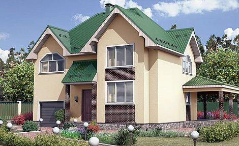
                                                    

                                                    

                                                        
                                                    

                                                    

                                                        
                                                    

                                                    

                                                        
                                                    

                                                    

                                                        
                                                    

                                                

                                                

                                            

                                            

                                                

                                                    

                                                        <a href="#">Флоренция Small</a>
                                                    

                                                    

                                                        Построим на выбраном вами участке
                                                    

                                                    
от 10 000 000 ₽

                                                

                                                

                                                    

                                                        
Комнат:

                                                        
2

                                                    

                                                    

                                                        
Санузлов:

                                                        
1

                                                    

                                                    

                                                        
Этажей:

                                                        
1

                                                    

                                                    

                                                        
Площадь:

                                                        
102 м²

                                                    

                                                

                                            

                                            

                                                
Проект дома

                                                

                                                    <button class="house-icon__btn">
                                                        
                                                    </button>
                                                    <button class="house-icon__btn">
                                                        
                                                    </button>
                                                

                                            

                                        

                                    

                                

                                

                                    

                                        

                                            

                                                

                                                    

                                                        
                                                    

                                                    

                                                        
                                                    

                                                    

                                                        
                                                    

                                                    

                                                        
                                                    

                                                    

                                                        
                                                    

                                                

                                                

                                            

                                            

                                                

                                                    

                                                        <a href="#">Флоренция Small</a>
                                                    

                                                    

                                                        Построим на выбраном вами участке
                                                    

                                                    
от 10 000 000 ₽

                                                

                                                

                                                    

                                                        
Комнат:

                                                        
2

                                                    

                                                    

                                                        
Санузлов:

                                                        
1

                                                    

                                                    

                                                        
Этажей:

                                                        
1

                                                    

                                                    

                                                        
Площадь:

                                                        
102 м²

                                                    

                                                

                                            

                                            

                                                
Проект дома

                                                

                                                    <button class="house-icon__btn">
                                                        
                                                    </button>
                                                    <button class="house-icon__btn">
                                                        
                                                    </button>
                                                

                                            

                                        

                                    

                                

                                

                                    

                                        Slide 3
                                    

                                

                                

                                    

                                        Slide 4
                                    

                                

                                

                                    

                                        Slide 5
                                    

                                

                                

                                    

                                        Slide 6
                                    

                                

                            

                            

                            

                                
                            

                            

                                
                            

                        

                        <a class="privileges__link" href="#">
                            Смотреть все
                            
                        </a>
                    

                

            

        </section>

        <!-- stages -->
        <section class="stages stages-desctop"> 
            

                <h2 class="section-title stages-title">
                    Этапы строительства дома
                </h2>
            

            

                

                    

                        

                            

                                
                                
                                
                                
                                
                                
                                
                                
                            
  
                            <svg width="58" height="58" viewBox="0 0 58 58" fill="none" xmlns="http://www.w3.org/2000/svg">
                                <rect width="58" height="58" rx="6" fill="#F0F4FB"/>
                                <path d="M14.8335 29.7083L17.3149 27.5371C18.6059 26.4076 20.5516 26.4723 21.7645 27.6853L27.8416 33.7624C28.8151 34.736 30.3477 34.8688 31.4742 34.077L31.8967 33.7802C33.5176 32.6409 35.7108 32.773 37.1835 34.0984L41.7502 38.2083" stroke="#005AA3" stroke-linecap="round"/>
                                <path d="M38.296 16.1586L38.8869 15.5678C39.866 14.5887 41.4532 14.5887 42.4323 15.5678C43.4113 16.5468 43.4113 18.1341 42.4323 19.1131L41.8414 19.704M38.296 16.1586C38.296 16.1586 38.37 17.4143 39.4778 18.5222C40.5858 19.6301 41.8414 19.704 41.8414 19.704M38.296 16.1586L32.8638 21.5909C32.4958 21.9589 32.3119 22.1428 32.1536 22.3457C31.9671 22.585 31.807 22.8439 31.6765 23.1178C31.5657 23.3501 31.4836 23.5969 31.3189 24.0905L30.7921 25.671M41.8414 19.704L36.409 25.1362C36.0411 25.5042 35.8572 25.6882 35.6544 25.8464C35.4151 26.033 35.1561 26.193 34.8821 26.3235C34.6499 26.4343 34.4032 26.5165 33.9095 26.6811L32.329 27.2079M30.7921 25.671L30.4512 26.6937C30.3702 26.9365 30.4335 27.2044 30.6146 27.3854C30.7956 27.5665 31.0635 27.6298 31.3063 27.5488L32.329 27.2079M30.7921 25.671L32.329 27.2079" stroke="#005AA3"/>
                                <path d="M43.1668 29.0002C43.1668 35.6783 43.1668 39.0176 41.0921 41.0921C39.0176 43.1668 35.6783 43.1668 29.0002 43.1668C22.3219 43.1668 18.9828 43.1668 16.9082 41.0921C14.8335 39.0176 14.8335 35.6783 14.8335 29.0002C14.8335 27.4017 14.8335 25.9945 14.8619 24.7502M29.0002 14.8335C22.3219 14.8335 18.9828 14.8335 16.9082 16.9082C16.3063 17.51 15.8791 18.2182 15.5758 19.0835" stroke="#005AA3" stroke-linecap="round"/>
                            </svg> 
                            <h3 class="stages__slide-title">
                                Разработка проекта
                            </h3> 
                            

                                Этот этап включает в себя определение основных параметров будущего дома, таких как количество комнат, планировка, выбор материалов для строительства и отделки. Также на этом этапе происходит согласование всех деталей с заказчиком.
                            
                                
                        

                    

                    

                        

                            

                                
                                
                                
                                
                                
                                
                                
                                
                            
  
                            <svg width="58" height="58" viewBox="0 0 58 58" fill="none" xmlns="http://www.w3.org/2000/svg">
                                <rect width="58" height="58" rx="6" fill="#F0F4FB"/>
                                <path d="M24.9917 17.6668C25.5751 16.0161 27.1494 14.8335 28.9998 14.8335C30.8504 14.8335 32.4246 16.0161 33.008 17.6668" stroke="#005AA3" stroke-linecap="round"/>
                                <path d="M41.0415 20.5H16.958" stroke="#005AA3" stroke-linecap="round"/>
                                <path d="M38.0289 33.8152C37.7781 37.5763 37.6528 39.457 36.4274 40.6033C35.2019 41.7498 33.3172 41.7498 29.5477 41.7498H28.4521C24.6826 41.7498 22.7979 41.7498 21.5725 40.6033C20.347 39.457 20.2217 37.5763 19.9709 33.8152L19.3193 24.0415M38.6804 24.0415L38.3971 28.2915" stroke="#005AA3" stroke-linecap="round"/>
                                <path d="M25.4585 27.5835L26.1668 34.6668" stroke="#005AA3" stroke-linecap="round"/>
                                <path d="M32.5418 27.5835L31.8335 34.6668" stroke="#005AA3" stroke-linecap="round"/>
                            </svg>                                
                            <h3 class="stages__slide-title">
                                Подготовка участка
                            </h3> 
                            

                                Перед началом строительства необходимо провести подготовительные работы на участке: очистить его от мусора и растительности, выровнять поверхность земли.             
                            
                                
                        

                    

                    

                        

                            

                                
                                
                                
                                
                                
                                
                                
                                
                            
  
                            <svg width="58" height="58" viewBox="0 0 58 58" fill="none" xmlns="http://www.w3.org/2000/svg">
                                <rect width="58" height="58" rx="6" fill="#F0F4FB"/>
                                <path d="M29 14.8335V26.1668M29 26.1668L33.25 21.9168M29 26.1668L24.75 21.9168" stroke="#005AA3" stroke-linecap="round" stroke-linejoin="round"/>
                                <path d="M14.8335 30.4165H19.3105C20.5929 30.4165 21.234 30.4165 21.7976 30.6758C22.3612 30.9349 22.7785 31.4218 23.613 32.3953L24.4707 33.396C25.3052 34.3696 25.7225 34.8565 26.2861 35.1156C26.8497 35.3748 27.4908 35.3748 28.7731 35.3748H29.2273C30.5095 35.3748 31.1507 35.3748 31.7142 35.1156C32.2779 34.8565 32.6951 34.3696 33.5297 33.396L34.3873 32.3953C35.2219 31.4218 35.6391 30.9349 36.2028 30.6758C36.7663 30.4165 37.4075 30.4165 38.6897 30.4165H43.1668" stroke="#005AA3" stroke-linecap="round"/>
                                <path d="M43.1668 29.0001C43.1668 35.6783 43.1668 39.0175 41.0921 41.0921C39.0176 43.1668 35.6783 43.1668 29.0002 43.1668C22.3219 43.1668 18.9828 43.1668 16.9082 41.0921C14.8335 39.0175 14.8335 35.6783 14.8335 29.0001C14.8335 22.3219 14.8335 18.9828 16.9082 16.9081C18.0648 15.7515 19.6145 15.2397 21.9168 15.0132M36.0835 15.0132C38.3857 15.2397 39.9356 15.7515 41.0921 16.9081C42.4717 18.2876 42.9339 20.2259 43.0888 23.3333" stroke="#005AA3" stroke-linecap="round"/>
                            </svg>                                                              
                            <h3 class="stages__slide-title">
                                Заливка фундамента
                            </h3> 
                            

                                Фундамент является основой любого здания, поэтому его заливке уделяют особое внимание. В зависимости от типа грунта и размеров дома выбирается соответствующий вид фундамента (ленточный, столбчатый или плитный).
                            
                                
                        

                    

                    

                        

                            

                                
                                
                                
                                
                                
                                
                                
                                
                            
  
                            <svg width="58" height="58" viewBox="0 0 58 58" fill="none" xmlns="http://www.w3.org/2000/svg">
                                <rect width="58" height="58" rx="6" fill="#F0F4FB"/>
                                <path d="M14.8335 23.3338V20.3392C14.8335 17.9278 14.8335 16.7222 15.6019 16.3267C16.3704 15.9313 17.3515 16.6321 19.3137 18.0336L21.5538 19.6337C22.4262 20.2569 22.8625 20.5685 23.098 21.0262C23.3335 21.4838 23.3335 22.0199 23.3335 23.0921V34.9084C23.3335 35.9805 23.3335 36.5166 23.098 36.9743C22.8625 37.4319 22.4262 37.7435 21.5538 38.3667L19.3137 39.9667C17.3515 41.3684 16.3704 42.069 15.6019 41.6736C14.8335 41.2782 14.8335 40.0725 14.8335 37.6611V29.0004" stroke="#005AA3" stroke-linecap="round"/>
                                <path d="M43.1665 29.0004V20.3392C43.1665 17.9278 43.1665 16.7222 42.3981 16.3267C41.6297 15.9313 40.6485 16.6321 38.6863 18.0336L36.4463 19.6337C35.5737 20.2569 35.1375 20.5685 34.902 21.0262C34.6665 21.4838 34.6665 22.0199 34.6665 23.0921V34.9084C34.6665 35.9805 34.6665 36.5166 34.902 36.9743C35.1375 37.4319 35.5737 37.7435 36.4463 38.3667L38.6863 39.9667C40.6485 41.3684 41.6297 42.069 42.3981 41.6736C43.1665 41.2782 43.1665 40.0725 43.1665 37.6611V34.7474" stroke="#005AA3" stroke-linecap="round"/>
                                <path d="M29 31.8335V26.1668M29 20.5002V14.8335M29 43.1668V37.5002" stroke="#005AA3" stroke-linecap="round"/>
                            </svg>                                                                                             
                            <h3 class="stages__slide-title">
                                Возведение стен
                            </h3> 
                            

                                После того как фундамент готов, начинается строительство стен и перегородок из выбранного материала (кирпич, блоки или дерево).
                            
                                
                        

                    

                    

                        

                            

                                
                                
                                
                                
                                
                                
                                
                                
                            
  
                            <svg width="58" height="58" viewBox="0 0 58 58" fill="none" xmlns="http://www.w3.org/2000/svg">
                                <rect width="58" height="58" rx="6" fill="#F0F4FB"/>
                                <path d="M26.1668 16.25H43.1668M14.8335 16.25H20.5002" stroke="#005AA3" stroke-linecap="round"/>
                                <path d="M19.0835 30.4165V38.2082C19.0835 39.5322 19.0835 40.1942 19.3682 40.6873C19.5547 41.0103 19.823 41.2787 20.146 41.4651C20.6391 41.7498 21.3011 41.7498 22.6252 41.7498C23.9492 41.7498 24.6112 41.7498 25.1043 41.4651C25.4274 41.2787 25.6956 41.0103 25.8821 40.6873C26.1668 40.1942 26.1668 39.5322 26.1668 38.2082V25.4582C26.1668 24.1341 26.1668 23.4721 25.8821 22.979C25.6956 22.656 25.4274 22.3877 25.1043 22.2012C24.6112 21.9165 23.9492 21.9165 22.6252 21.9165C21.3011 21.9165 20.6391 21.9165 20.146 22.2012C19.823 22.3877 19.5547 22.656 19.3682 22.979C19.1395 23.3751 19.0945 23.8802 19.0857 24.7498" stroke="#005AA3" stroke-linecap="round"/>
                                <path d="M35.3752 21.9165C34.0511 21.9165 33.3891 21.9165 32.896 22.2012C32.573 22.3877 32.3047 22.656 32.1182 22.979C31.8335 23.4721 31.8335 24.1341 31.8335 25.4582V33.9582C31.8335 35.2822 31.8335 35.9442 32.1182 36.4373C32.3047 36.7603 32.573 37.0287 32.896 37.2151C33.3891 37.4998 34.0511 37.4998 35.3752 37.4998C36.6992 37.4998 37.3612 37.4998 37.8543 37.2151C38.1773 37.0287 38.4456 36.7603 38.6321 36.4373C38.9168 35.9442 38.9168 35.2822 38.9168 33.9582V25.4582C38.9168 24.1341 38.9168 23.4721 38.6321 22.979C38.4456 22.656 38.1773 22.3877 37.8543 22.2012C37.3612 21.9165 36.6992 21.9165 35.3752 21.9165Z" stroke="#005AA3"/>
                            </svg>                                                                                                                                 
                            <h3 class="stages__slide-title">
                                Установка крыши
                            </h3> 
                            

                                Крыша защищает дом от осадков и солнечного излучения, поэтому ее монтаж является одним из самых ответственных этапов строительства.                                
                                
                        

                    

                    

                        

                            

                                
                                
                                
                                
                                
                                
                                
                                
                            
  
                            <svg width="58" height="58" viewBox="0 0 58 58" fill="none" xmlns="http://www.w3.org/2000/svg">
                                <rect width="58" height="58" rx="6" fill="#F0F4FB"/>
                                <path d="M24.75 18.375H23.3333C19.9942 18.375 18.3247 18.375 17.2873 19.4123C16.25 20.4497 16.25 22.1192 16.25 25.4583V26.1667M24.75 39.625H23.3333C19.9942 39.625 18.3247 39.625 17.2873 38.5877C16.25 37.5503 16.25 35.8807 16.25 32.5417V31.8333" stroke="#005AA3" stroke-linecap="round"/>
                                <path d="M31.3483 15.3256C28.2853 14.7914 26.7539 14.5242 25.7519 15.4125C24.75 16.3007 24.75 17.9255 24.75 21.1751V36.8253C24.75 40.0748 24.75 41.6996 25.7519 42.5878C26.7539 43.4761 28.2853 43.2089 31.3483 42.6747L34.6474 42.0994C38.0396 41.5076 39.7356 41.2118 40.7429 39.9676C41.75 38.7234 41.75 36.924 41.75 33.3251V24.6752C41.75 21.0763 41.75 19.2769 40.7429 18.0327C40.0698 17.2012 39.0891 16.7933 37.5 16.4376" stroke="#005AA3" stroke-linecap="round"/>
                                <path d="M29 27.5835V30.4168" stroke="#005AA3" stroke-linecap="round"/>
                            </svg>                                                                                                                                                                     
                            <h3 class="stages__slide-title">
                                Окна и двери
                            </h3> 
                            

                                Установка окон и дверей производится после завершения работ по возведению стен и крыши.
                            
                                
                        

                    

                    

                        

                            

                                
                                
                                
                                
                                
                                
                                
                                
                            
  
                            <svg width="58" height="58" viewBox="0 0 58 58" fill="none" xmlns="http://www.w3.org/2000/svg">
                                <rect width="58" height="58" rx="6" fill="#F0F4FB"/>
                                <path d="M20.5562 23.0105C17.0716 23.799 15.3294 24.1932 14.9148 25.5261C14.5003 26.859 15.6881 28.2481 18.0636 31.0259L18.6782 31.7445C19.3533 32.5339 19.6908 32.9286 19.8426 33.4169C19.9945 33.9052 19.9435 34.4318 19.8414 35.4851L19.7485 36.4439C19.3893 40.1502 19.2098 42.0033 20.295 42.8271C21.3802 43.6509 23.0115 42.8998 26.2741 41.3977L27.1181 41.009C28.0452 40.5821 28.5087 40.3686 29.0002 40.3686C29.4916 40.3686 29.9551 40.5821 30.8822 41.009L31.7263 41.3977C34.9888 42.8998 36.6201 43.6509 37.7054 42.8271C38.7906 42.0033 38.611 40.1502 38.2518 36.4439M39.9367 31.0259C42.3123 28.2481 43.5 26.859 43.0855 25.5261C42.671 24.1932 40.9286 23.799 37.4442 23.0105L36.5426 22.8066C35.5524 22.5825 35.0574 22.4705 34.6599 22.1687C34.2622 21.8669 34.0074 21.4096 33.4974 20.4948L33.0331 19.662C31.2388 16.443 30.3416 14.8335 29.0002 14.8335C27.6587 14.8335 26.7615 16.443 24.9671 19.662" stroke="#005AA3" stroke-linecap="round"/>
                            </svg>                                                                                                                                                                                                         
                            <h3 class="stages__slide-title">
                                Отделка помещений
                            </h3> 
                            

                                Это заключительный этап строительства, который включает в себя отделку потолков, стен и пола, установку сантехники и электрооборудования.
                            
                                
                        

                    

                    

                        

                            

                                
                                
                                
                                
                                
                                
                                
                                
                            
  
                            <svg width="58" height="58" viewBox="0 0 58 58" fill="none" xmlns="http://www.w3.org/2000/svg">
                                <rect width="58" height="58" rx="6" fill="#F0F4FB"/>
                                <path d="M41.8447 19.0835C42.6832 20.4407 43.1668 22.0387 43.1668 23.7492C43.1668 28.6732 39.1588 32.6649 34.2145 32.6649C33.3124 32.6649 31.2582 32.4575 30.2589 31.6282L29.0097 32.8723C27.9688 33.9089 28.8015 33.9089 29.2179 34.7384C29.2179 34.7384 30.2589 36.1897 29.2179 37.6411C28.5933 38.4704 26.8444 39.6315 24.8458 37.6411L24.4295 38.0558C24.4295 38.0558 25.6786 39.5072 24.6377 40.9585C24.0131 41.788 22.3475 42.6173 20.8902 41.1659C20.8208 41.2351 20.4322 41.6221 19.4328 42.6173C18.4335 43.6125 17.2122 43.032 16.7264 42.6173L15.4772 41.3732C14.3114 40.2121 14.9915 38.9542 15.4772 38.4704L26.3033 27.6888C26.3033 27.6888 25.2623 26.0299 25.2623 23.7492C25.2623 18.8252 29.2703 14.8335 34.2145 14.8335C35.3745 14.8335 36.483 15.0532 37.5002 15.4531" stroke="#005AA3" stroke-linecap="round" stroke-linejoin="round"/>
                                <path d="M37.3371 23.7493C37.3371 25.467 35.939 26.8594 34.2142 26.8594C32.4896 26.8594 31.0913 25.467 31.0913 23.7493C31.0913 22.0316 32.4896 20.6392 34.2142 20.6392C35.939 20.6392 37.3371 22.0316 37.3371 23.7493Z" stroke="#005AA3"/>
                            </svg>                                                                                                                                                                                                                                             
                            <h3 class="stages__slide-title">
                                Сдача объекта заказчику
                            </h3> 
                            

                                После окончания всех работ по строительству дома под ключ он сдаётся заказчику для проживания или использования по назначению.
                            
                                
                        

                    

                

            

        </section>

        <!-- stages-mobile -->
        <section class="stages stages-mobile"> 
            

                <h2 class="section-title stages-title">
                    Этапы строительства дома
                </h2>
                

                    

                        

                            

                                

                                    
                                    
                                    
                                    
                                    
                                    
                                    
                                    
                                
  
                                <svg width="58" height="58" viewBox="0 0 58 58" fill="none" xmlns="http://www.w3.org/2000/svg">
                                    <rect width="58" height="58" rx="6" fill="#F0F4FB"/>
                                    <path d="M14.8335 29.7083L17.3149 27.5371C18.6059 26.4076 20.5516 26.4723 21.7645 27.6853L27.8416 33.7624C28.8151 34.736 30.3477 34.8688 31.4742 34.077L31.8967 33.7802C33.5176 32.6409 35.7108 32.773 37.1835 34.0984L41.7502 38.2083" stroke="#005AA3" stroke-linecap="round"/>
                                    <path d="M38.296 16.1586L38.8869 15.5678C39.866 14.5887 41.4532 14.5887 42.4323 15.5678C43.4113 16.5468 43.4113 18.1341 42.4323 19.1131L41.8414 19.704M38.296 16.1586C38.296 16.1586 38.37 17.4143 39.4778 18.5222C40.5858 19.6301 41.8414 19.704 41.8414 19.704M38.296 16.1586L32.8638 21.5909C32.4958 21.9589 32.3119 22.1428 32.1536 22.3457C31.9671 22.585 31.807 22.8439 31.6765 23.1178C31.5657 23.3501 31.4836 23.5969 31.3189 24.0905L30.7921 25.671M41.8414 19.704L36.409 25.1362C36.0411 25.5042 35.8572 25.6882 35.6544 25.8464C35.4151 26.033 35.1561 26.193 34.8821 26.3235C34.6499 26.4343 34.4032 26.5165 33.9095 26.6811L32.329 27.2079M30.7921 25.671L30.4512 26.6937C30.3702 26.9365 30.4335 27.2044 30.6146 27.3854C30.7956 27.5665 31.0635 27.6298 31.3063 27.5488L32.329 27.2079M30.7921 25.671L32.329 27.2079" stroke="#005AA3"/>
                                    <path d="M43.1668 29.0002C43.1668 35.6783 43.1668 39.0176 41.0921 41.0921C39.0176 43.1668 35.6783 43.1668 29.0002 43.1668C22.3219 43.1668 18.9828 43.1668 16.9082 41.0921C14.8335 39.0176 14.8335 35.6783 14.8335 29.0002C14.8335 27.4017 14.8335 25.9945 14.8619 24.7502M29.0002 14.8335C22.3219 14.8335 18.9828 14.8335 16.9082 16.9082C16.3063 17.51 15.8791 18.2182 15.5758 19.0835" stroke="#005AA3" stroke-linecap="round"/>
                                </svg> 
                                <h3 class="stages__slide-title">
                                    Разработка проекта
                                </h3> 
                                

                                    Этот этап включает в себя определение основных параметров будущего дома, таких как количество комнат, планировка, выбор материалов для строительства и отделки. Также на этом этапе происходит согласование всех деталей с заказчиком.
                                
                                
                            

                        

                        

                            

                                

                                    
                                    
                                    
                                    
                                    
                                    
                                    
                                    
                                
  
                                <svg width="58" height="58" viewBox="0 0 58 58" fill="none" xmlns="http://www.w3.org/2000/svg">
                                    <rect width="58" height="58" rx="6" fill="#F0F4FB"/>
                                    <path d="M24.9917 17.6668C25.5751 16.0161 27.1494 14.8335 28.9998 14.8335C30.8504 14.8335 32.4246 16.0161 33.008 17.6668" stroke="#005AA3" stroke-linecap="round"/>
                                    <path d="M41.0415 20.5H16.958" stroke="#005AA3" stroke-linecap="round"/>
                                    <path d="M38.0289 33.8152C37.7781 37.5763 37.6528 39.457 36.4274 40.6033C35.2019 41.7498 33.3172 41.7498 29.5477 41.7498H28.4521C24.6826 41.7498 22.7979 41.7498 21.5725 40.6033C20.347 39.457 20.2217 37.5763 19.9709 33.8152L19.3193 24.0415M38.6804 24.0415L38.3971 28.2915" stroke="#005AA3" stroke-linecap="round"/>
                                    <path d="M25.4585 27.5835L26.1668 34.6668" stroke="#005AA3" stroke-linecap="round"/>
                                    <path d="M32.5418 27.5835L31.8335 34.6668" stroke="#005AA3" stroke-linecap="round"/>
                                </svg>                                
                                <h3 class="stages__slide-title">
                                    Подготовка участка
                                </h3> 
                                

                                    Перед началом строительства необходимо провести подготовительные работы на участке: очистить его от мусора и растительности, выровнять поверхность земли.             
                                
                                
                            

                        

                        

                            

                                

                                    
                                    
                                    
                                    
                                    
                                    
                                    
                                    
                                
  
                                <svg width="58" height="58" viewBox="0 0 58 58" fill="none" xmlns="http://www.w3.org/2000/svg">
                                    <rect width="58" height="58" rx="6" fill="#F0F4FB"/>
                                    <path d="M29 14.8335V26.1668M29 26.1668L33.25 21.9168M29 26.1668L24.75 21.9168" stroke="#005AA3" stroke-linecap="round" stroke-linejoin="round"/>
                                    <path d="M14.8335 30.4165H19.3105C20.5929 30.4165 21.234 30.4165 21.7976 30.6758C22.3612 30.9349 22.7785 31.4218 23.613 32.3953L24.4707 33.396C25.3052 34.3696 25.7225 34.8565 26.2861 35.1156C26.8497 35.3748 27.4908 35.3748 28.7731 35.3748H29.2273C30.5095 35.3748 31.1507 35.3748 31.7142 35.1156C32.2779 34.8565 32.6951 34.3696 33.5297 33.396L34.3873 32.3953C35.2219 31.4218 35.6391 30.9349 36.2028 30.6758C36.7663 30.4165 37.4075 30.4165 38.6897 30.4165H43.1668" stroke="#005AA3" stroke-linecap="round"/>
                                    <path d="M43.1668 29.0001C43.1668 35.6783 43.1668 39.0175 41.0921 41.0921C39.0176 43.1668 35.6783 43.1668 29.0002 43.1668C22.3219 43.1668 18.9828 43.1668 16.9082 41.0921C14.8335 39.0175 14.8335 35.6783 14.8335 29.0001C14.8335 22.3219 14.8335 18.9828 16.9082 16.9081C18.0648 15.7515 19.6145 15.2397 21.9168 15.0132M36.0835 15.0132C38.3857 15.2397 39.9356 15.7515 41.0921 16.9081C42.4717 18.2876 42.9339 20.2259 43.0888 23.3333" stroke="#005AA3" stroke-linecap="round"/>
                                </svg>                                                              
                                <h3 class="stages__slide-title">
                                    Заливка фундамента
                                </h3> 
                                

                                    Фундамент является основой любого здания, поэтому его заливке уделяют особое внимание. В зависимости от типа грунта и размеров дома выбирается соответствующий вид фундамента (ленточный, столбчатый или плитный).
                                
                                
                            

                        

                        

                            

                                

                                    
                                    
                                    
                                    
                                    
                                    
                                    
                                    
                                
  
                                <svg width="58" height="58" viewBox="0 0 58 58" fill="none" xmlns="http://www.w3.org/2000/svg">
                                    <rect width="58" height="58" rx="6" fill="#F0F4FB"/>
                                    <path d="M14.8335 23.3338V20.3392C14.8335 17.9278 14.8335 16.7222 15.6019 16.3267C16.3704 15.9313 17.3515 16.6321 19.3137 18.0336L21.5538 19.6337C22.4262 20.2569 22.8625 20.5685 23.098 21.0262C23.3335 21.4838 23.3335 22.0199 23.3335 23.0921V34.9084C23.3335 35.9805 23.3335 36.5166 23.098 36.9743C22.8625 37.4319 22.4262 37.7435 21.5538 38.3667L19.3137 39.9667C17.3515 41.3684 16.3704 42.069 15.6019 41.6736C14.8335 41.2782 14.8335 40.0725 14.8335 37.6611V29.0004" stroke="#005AA3" stroke-linecap="round"/>
                                    <path d="M43.1665 29.0004V20.3392C43.1665 17.9278 43.1665 16.7222 42.3981 16.3267C41.6297 15.9313 40.6485 16.6321 38.6863 18.0336L36.4463 19.6337C35.5737 20.2569 35.1375 20.5685 34.902 21.0262C34.6665 21.4838 34.6665 22.0199 34.6665 23.0921V34.9084C34.6665 35.9805 34.6665 36.5166 34.902 36.9743C35.1375 37.4319 35.5737 37.7435 36.4463 38.3667L38.6863 39.9667C40.6485 41.3684 41.6297 42.069 42.3981 41.6736C43.1665 41.2782 43.1665 40.0725 43.1665 37.6611V34.7474" stroke="#005AA3" stroke-linecap="round"/>
                                    <path d="M29 31.8335V26.1668M29 20.5002V14.8335M29 43.1668V37.5002" stroke="#005AA3" stroke-linecap="round"/>
                                </svg>                                                                                             
                                <h3 class="stages__slide-title">
                                    Возведение стен
                                </h3> 
                                

                                    После того как фундамент готов, начинается строительство стен и перегородок из выбранного материала (кирпич, блоки или дерево).
                                
                                
                            

                        

                        

                            

                                

                                    
                                    
                                    
                                    
                                    
                                    
                                    
                                    
                                
  
                                <svg width="58" height="58" viewBox="0 0 58 58" fill="none" xmlns="http://www.w3.org/2000/svg">
                                    <rect width="58" height="58" rx="6" fill="#F0F4FB"/>
                                    <path d="M26.1668 16.25H43.1668M14.8335 16.25H20.5002" stroke="#005AA3" stroke-linecap="round"/>
                                    <path d="M19.0835 30.4165V38.2082C19.0835 39.5322 19.0835 40.1942 19.3682 40.6873C19.5547 41.0103 19.823 41.2787 20.146 41.4651C20.6391 41.7498 21.3011 41.7498 22.6252 41.7498C23.9492 41.7498 24.6112 41.7498 25.1043 41.4651C25.4274 41.2787 25.6956 41.0103 25.8821 40.6873C26.1668 40.1942 26.1668 39.5322 26.1668 38.2082V25.4582C26.1668 24.1341 26.1668 23.4721 25.8821 22.979C25.6956 22.656 25.4274 22.3877 25.1043 22.2012C24.6112 21.9165 23.9492 21.9165 22.6252 21.9165C21.3011 21.9165 20.6391 21.9165 20.146 22.2012C19.823 22.3877 19.5547 22.656 19.3682 22.979C19.1395 23.3751 19.0945 23.8802 19.0857 24.7498" stroke="#005AA3" stroke-linecap="round"/>
                                    <path d="M35.3752 21.9165C34.0511 21.9165 33.3891 21.9165 32.896 22.2012C32.573 22.3877 32.3047 22.656 32.1182 22.979C31.8335 23.4721 31.8335 24.1341 31.8335 25.4582V33.9582C31.8335 35.2822 31.8335 35.9442 32.1182 36.4373C32.3047 36.7603 32.573 37.0287 32.896 37.2151C33.3891 37.4998 34.0511 37.4998 35.3752 37.4998C36.6992 37.4998 37.3612 37.4998 37.8543 37.2151C38.1773 37.0287 38.4456 36.7603 38.6321 36.4373C38.9168 35.9442 38.9168 35.2822 38.9168 33.9582V25.4582C38.9168 24.1341 38.9168 23.4721 38.6321 22.979C38.4456 22.656 38.1773 22.3877 37.8543 22.2012C37.3612 21.9165 36.6992 21.9165 35.3752 21.9165Z" stroke="#005AA3"/>
                                </svg>                                                                                                                                 
                                <h3 class="stages__slide-title">
                                    Установка крыши
                                </h3> 
                                

                                    Крыша защищает дом от осадков и солнечного излучения, поэтому ее монтаж является одним из самых ответственных этапов строительства.                                
                                
                            

                        

                        

                            

                                

                                    
                                    
                                    
                                    
                                    
                                    
                                    
                                    
                                
  
                                <svg width="58" height="58" viewBox="0 0 58 58" fill="none" xmlns="http://www.w3.org/2000/svg">
                                    <rect width="58" height="58" rx="6" fill="#F0F4FB"/>
                                    <path d="M24.75 18.375H23.3333C19.9942 18.375 18.3247 18.375 17.2873 19.4123C16.25 20.4497 16.25 22.1192 16.25 25.4583V26.1667M24.75 39.625H23.3333C19.9942 39.625 18.3247 39.625 17.2873 38.5877C16.25 37.5503 16.25 35.8807 16.25 32.5417V31.8333" stroke="#005AA3" stroke-linecap="round"/>
                                    <path d="M31.3483 15.3256C28.2853 14.7914 26.7539 14.5242 25.7519 15.4125C24.75 16.3007 24.75 17.9255 24.75 21.1751V36.8253C24.75 40.0748 24.75 41.6996 25.7519 42.5878C26.7539 43.4761 28.2853 43.2089 31.3483 42.6747L34.6474 42.0994C38.0396 41.5076 39.7356 41.2118 40.7429 39.9676C41.75 38.7234 41.75 36.924 41.75 33.3251V24.6752C41.75 21.0763 41.75 19.2769 40.7429 18.0327C40.0698 17.2012 39.0891 16.7933 37.5 16.4376" stroke="#005AA3" stroke-linecap="round"/>
                                    <path d="M29 27.5835V30.4168" stroke="#005AA3" stroke-linecap="round"/>
                                </svg>                                                                                                                                                                     
                                <h3 class="stages__slide-title">
                                    Окна и двери
                                </h3> 
                                

                                    Установка окон и дверей производится после завершения работ по возведению стен и крыши.
                                
                                
                            

                        

                        

                            

                                

                                    
                                    
                                    
                                    
                                    
                                    
                                    
                                    
                                
  
                                <svg width="58" height="58" viewBox="0 0 58 58" fill="none" xmlns="http://www.w3.org/2000/svg">
                                    <rect width="58" height="58" rx="6" fill="#F0F4FB"/>
                                    <path d="M20.5562 23.0105C17.0716 23.799 15.3294 24.1932 14.9148 25.5261C14.5003 26.859 15.6881 28.2481 18.0636 31.0259L18.6782 31.7445C19.3533 32.5339 19.6908 32.9286 19.8426 33.4169C19.9945 33.9052 19.9435 34.4318 19.8414 35.4851L19.7485 36.4439C19.3893 40.1502 19.2098 42.0033 20.295 42.8271C21.3802 43.6509 23.0115 42.8998 26.2741 41.3977L27.1181 41.009C28.0452 40.5821 28.5087 40.3686 29.0002 40.3686C29.4916 40.3686 29.9551 40.5821 30.8822 41.009L31.7263 41.3977C34.9888 42.8998 36.6201 43.6509 37.7054 42.8271C38.7906 42.0033 38.611 40.1502 38.2518 36.4439M39.9367 31.0259C42.3123 28.2481 43.5 26.859 43.0855 25.5261C42.671 24.1932 40.9286 23.799 37.4442 23.0105L36.5426 22.8066C35.5524 22.5825 35.0574 22.4705 34.6599 22.1687C34.2622 21.8669 34.0074 21.4096 33.4974 20.4948L33.0331 19.662C31.2388 16.443 30.3416 14.8335 29.0002 14.8335C27.6587 14.8335 26.7615 16.443 24.9671 19.662" stroke="#005AA3" stroke-linecap="round"/>
                                </svg>                                                                                                                                                                                                         
                                <h3 class="stages__slide-title">
                                    Отделка помещений
                                </h3> 
                                

                                    Это заключительный этап строительства, который включает в себя отделку потолков, стен и пола, установку сантехники и электрооборудования.
                                
                                
                            

                        

                        

                            

                                

                                    
                                    
                                    
                                    
                                    
                                    
                                    
                                    
                                
  
                                <svg width="58" height="58" viewBox="0 0 58 58" fill="none" xmlns="http://www.w3.org/2000/svg">
                                    <rect width="58" height="58" rx="6" fill="#F0F4FB"/>
                                    <path d="M41.8447 19.0835C42.6832 20.4407 43.1668 22.0387 43.1668 23.7492C43.1668 28.6732 39.1588 32.6649 34.2145 32.6649C33.3124 32.6649 31.2582 32.4575 30.2589 31.6282L29.0097 32.8723C27.9688 33.9089 28.8015 33.9089 29.2179 34.7384C29.2179 34.7384 30.2589 36.1897 29.2179 37.6411C28.5933 38.4704 26.8444 39.6315 24.8458 37.6411L24.4295 38.0558C24.4295 38.0558 25.6786 39.5072 24.6377 40.9585C24.0131 41.788 22.3475 42.6173 20.8902 41.1659C20.8208 41.2351 20.4322 41.6221 19.4328 42.6173C18.4335 43.6125 17.2122 43.032 16.7264 42.6173L15.4772 41.3732C14.3114 40.2121 14.9915 38.9542 15.4772 38.4704L26.3033 27.6888C26.3033 27.6888 25.2623 26.0299 25.2623 23.7492C25.2623 18.8252 29.2703 14.8335 34.2145 14.8335C35.3745 14.8335 36.483 15.0532 37.5002 15.4531" stroke="#005AA3" stroke-linecap="round" stroke-linejoin="round"/>
                                    <path d="M37.3371 23.7493C37.3371 25.467 35.939 26.8594 34.2142 26.8594C32.4896 26.8594 31.0913 25.467 31.0913 23.7493C31.0913 22.0316 32.4896 20.6392 34.2142 20.6392C35.939 20.6392 37.3371 22.0316 37.3371 23.7493Z" stroke="#005AA3"/>
                                </svg>                                                                                                                                                                                                                                             
                                <h3 class="stages__slide-title">
                                    Сдача объекта заказчику
                                </h3> 
                                

                                    После окончания всех работ по строительству дома под ключ он сдаётся заказчику для проживания или использования по назначению.
                                
                                
                            

                        

                    

                

            

        </section>

        <!-- Форма по индивидуальному проекту -->
        <section class="yourPtoject">
            

                
 
                    <h2 class="section-title yourPtoject__info-title">
                        Построим дом по вашему индивидуальному проекту
                    </h2>
                    

                        Отправьте ваш проект используя контактную форму. Наш менеджер свяжется с вами, чтобы согласовать все детали.
                    

                

                <form class="bid__form" action="#">
                    

                        <input class="form-item" type="text" placeholder="Имя" required>
                        <input class="form-item" type="tel" placeholder="Телефон" required>
                    

                    

                        <label class="checkbox">
                            <input class="checkmark" type="checkbox" checked required>
                            
                            Согласен (-на) c <a href="#">политикой конфиденциальности</a>
                        </label>
                        <button class="bid-form__btn" type="submit">
                            Отправить проект
                            
                        </button>
                    

                </form>
            

        </section>

        <!-- materials -->
        <section class="materials mobile-desctop">
            

                

                    <h2 class="section-title materials-title">
                        Мы строим дома из высококачественных материалов
                    </h2>
                    

                        

                            <svg width="64" height="48" viewBox="0 0 64 48" fill="none" xmlns="http://www.w3.org/2000/svg">
                                <circle cx="40" cy="24" r="24" fill="url(#paint0_linear_6050_42)"/>
                                <circle cx="24" cy="24" r="24" fill="#005AA3"/>
                                <path d="M31.6998 18.5L21.7998 29.5L16.2998 25.1" stroke="white" stroke-width="2" stroke-linecap="round" stroke-linejoin="round"/>
                                <defs>
                                <linearGradient id="paint0_linear_6050_42" x1="40" y1="0" x2="40" y2="48" gradientUnits="userSpaceOnUse">
                                <stop stop-color="white" stop-opacity="0.3"/>
                                <stop offset="1" stop-color="white" stop-opacity="0"/>
                                </linearGradient>
                                </defs>
                            </svg>
                            <h3 class="materials__card-title">
                                Остекление
                            </h3>                        
                        

                        

                            Инновационные оконные системы, устанавливаемые в коттеджах, созданы на основе ПВХ профиля. Они эстетичны и энергоэффективны. Помимо высоких теплосберегающих параметров, они характеризуются повышенным коэффициентом шумоизоляции.
                        

                    

                    

                        

                            <svg width="64" height="48" viewBox="0 0 64 48" fill="none" xmlns="http://www.w3.org/2000/svg">
                                <circle cx="40" cy="24" r="24" fill="url(#paint0_linear_6050_42)"/>
                                <circle cx="24" cy="24" r="24" fill="#005AA3"/>
                                <path d="M31.6998 18.5L21.7998 29.5L16.2998 25.1" stroke="white" stroke-width="2" stroke-linecap="round" stroke-linejoin="round"/>
                                <defs>
                                <linearGradient id="paint0_linear_6050_42" x1="40" y1="0" x2="40" y2="48" gradientUnits="userSpaceOnUse">
                                <stop stop-color="white" stop-opacity="0.3"/>
                                <stop offset="1" stop-color="white" stop-opacity="0"/>
                                </linearGradient>
                                </defs>
                            </svg>
                            <h3 class="materials__card-title">
                                Кровля
                            </h3>                        
                        

                        

                            Монтаж кровли в коттеджах осуществлен из металлочерепицы, обладающей способностью сохранять безупречный вид
                            и эксплуатационные качества на протяжении десятилетий.
                            Для улучшения гидроизоляционных свойств используется специальная пленка.                        

                    

                

                

                    

                        

                            <svg width="64" height="48" viewBox="0 0 64 48" fill="none" xmlns="http://www.w3.org/2000/svg">
                                <circle cx="40" cy="24" r="24" fill="url(#paint0_linear_6050_42)"/>
                                <circle cx="24" cy="24" r="24" fill="#005AA3"/>
                                <path d="M31.6998 18.5L21.7998 29.5L16.2998 25.1" stroke="white" stroke-width="2" stroke-linecap="round" stroke-linejoin="round"/>
                                <defs>
                                <linearGradient id="paint0_linear_6050_42" x1="40" y1="0" x2="40" y2="48" gradientUnits="userSpaceOnUse">
                                <stop stop-color="white" stop-opacity="0.3"/>
                                <stop offset="1" stop-color="white" stop-opacity="0"/>
                                </linearGradient>
                                </defs>
                            </svg>
                            <h3 class="materials__card-title">
                                Стены
                            </h3>                        
                        

                        

                            Сооружение стен осуществляется из из газосиликатного блока – экологичного продукта из натурального сырья, обладающего высокими эксплуатационными качествами.                       
                        

                    

                    

                        

                            <svg width="64" height="48" viewBox="0 0 64 48" fill="none" xmlns="http://www.w3.org/2000/svg">
                                <circle cx="40" cy="24" r="24" fill="url(#paint0_linear_6050_42)"/>
                                <circle cx="24" cy="24" r="24" fill="#005AA3"/>
                                <path d="M31.6998 18.5L21.7998 29.5L16.2998 25.1" stroke="white" stroke-width="2" stroke-linecap="round" stroke-linejoin="round"/>
                                <defs>
                                <linearGradient id="paint0_linear_6050_42" x1="40" y1="0" x2="40" y2="48" gradientUnits="userSpaceOnUse">
                                <stop stop-color="white" stop-opacity="0.3"/>
                                <stop offset="1" stop-color="white" stop-opacity="0"/>
                                </linearGradient>
                                </defs>
                            </svg>
                            <h3 class="materials__card-title">
                                Фундамент
                            </h3>                        
                        

                        

                            Надежную устойчивость сооружений обеспечивает монолитный свайный ростверк из железобетона, эффективно распределяющий несущую нагрузку. Такая конструкция не только обладает повышенным качеством, но и несет экономическую выгоду.
                        

                    

                    

                        

                            <svg width="64" height="48" viewBox="0 0 64 48" fill="none" xmlns="http://www.w3.org/2000/svg">
                                <circle cx="40" cy="24" r="24" fill="url(#paint0_linear_6050_42)"/>
                                <circle cx="24" cy="24" r="24" fill="#005AA3"/>
                                <path d="M31.6998 18.5L21.7998 29.5L16.2998 25.1" stroke="white" stroke-width="2" stroke-linecap="round" stroke-linejoin="round"/>
                                <defs>
                                <linearGradient id="paint0_linear_6050_42" x1="40" y1="0" x2="40" y2="48" gradientUnits="userSpaceOnUse">
                                <stop stop-color="white" stop-opacity="0.3"/>
                                <stop offset="1" stop-color="white" stop-opacity="0"/>
                                </linearGradient>
                                </defs>
                            </svg>
                            <h3 class="materials__card-title">
                                Фасады
                            </h3>                        
                        

                        

                            При обустройстве фасадов строители придерживались нескольких принципов: эстетичность, высокие защитные свойства, длительность эксплуатации, выбирая для их реализации современные высокотехнологичные материалы.
                         

                    

                    
                

            

        </section>

        <!-- materials-mobile -->
        <section class="materials materials-mobile">
            

                <h2 class="section-title materials-title">
                    Мы строим дома из высококачественных материалов
                </h2>
                

                    
       
                        

                            

                                <svg width="64" height="48" viewBox="0 0 64 48" fill="none" xmlns="http://www.w3.org/2000/svg">
                                    <circle cx="40" cy="24" r="24" fill="url(#paint0_linear_6050_42)"/>
                                    <circle cx="24" cy="24" r="24" fill="#005AA3"/>
                                    <path d="M31.6998 18.5L21.7998 29.5L16.2998 25.1" stroke="white" stroke-width="2" stroke-linecap="round" stroke-linejoin="round"/>
                                    <defs>
                                    <linearGradient id="paint0_linear_6050_42" x1="40" y1="0" x2="40" y2="48" gradientUnits="userSpaceOnUse">
                                    <stop stop-color="white" stop-opacity="0.3"/>
                                    <stop offset="1" stop-color="white" stop-opacity="0"/>
                                    </linearGradient>
                                    </defs>
                                </svg>
                                <h3 class="materials__card-title">
                                    Остекление
                                </h3>                        
                            

                            

                                Инновационные оконные системы, устанавливаемые в коттеджах, созданы на основе ПВХ профиля. Они эстетичны и энергоэффективны. Помимо высоких теплосберегающих параметров, они характеризуются повышенным коэффициентом шумоизоляции.
                            

                        

                        

                            

                                <svg width="64" height="48" viewBox="0 0 64 48" fill="none" xmlns="http://www.w3.org/2000/svg">
                                    <circle cx="40" cy="24" r="24" fill="url(#paint0_linear_6050_42)"/>
                                    <circle cx="24" cy="24" r="24" fill="#005AA3"/>
                                    <path d="M31.6998 18.5L21.7998 29.5L16.2998 25.1" stroke="white" stroke-width="2" stroke-linecap="round" stroke-linejoin="round"/>
                                    <defs>
                                    <linearGradient id="paint0_linear_6050_42" x1="40" y1="0" x2="40" y2="48" gradientUnits="userSpaceOnUse">
                                    <stop stop-color="white" stop-opacity="0.3"/>
                                    <stop offset="1" stop-color="white" stop-opacity="0"/>
                                    </linearGradient>
                                    </defs>
                                </svg>
                                <h3 class="materials__card-title">
                                    Кровля
                                </h3>                        
                            

                            

                                Монтаж кровли в коттеджах осуществлен из металлочерепицы, обладающей способностью сохранять безупречный вид
                                и эксплуатационные качества на протяжении десятилетий.
                                Для улучшения гидроизоляционных свойств используется специальная пленка.                        

                        

                        

                            

                                <svg width="64" height="48" viewBox="0 0 64 48" fill="none" xmlns="http://www.w3.org/2000/svg">
                                    <circle cx="40" cy="24" r="24" fill="url(#paint0_linear_6050_42)"/>
                                    <circle cx="24" cy="24" r="24" fill="#005AA3"/>
                                    <path d="M31.6998 18.5L21.7998 29.5L16.2998 25.1" stroke="white" stroke-width="2" stroke-linecap="round" stroke-linejoin="round"/>
                                    <defs>
                                    <linearGradient id="paint0_linear_6050_42" x1="40" y1="0" x2="40" y2="48" gradientUnits="userSpaceOnUse">
                                    <stop stop-color="white" stop-opacity="0.3"/>
                                    <stop offset="1" stop-color="white" stop-opacity="0"/>
                                    </linearGradient>
                                    </defs>
                                </svg>
                                <h3 class="materials__card-title">
                                    Стены
                                </h3>                        
                            

                            

                                Сооружение стен осуществляется из из газосиликатного блока – экологичного продукта из натурального сырья, обладающего высокими эксплуатационными качествами.                       
                            

                        

                        

                            

                                <svg width="64" height="48" viewBox="0 0 64 48" fill="none" xmlns="http://www.w3.org/2000/svg">
                                    <circle cx="40" cy="24" r="24" fill="url(#paint0_linear_6050_42)"/>
                                    <circle cx="24" cy="24" r="24" fill="#005AA3"/>
                                    <path d="M31.6998 18.5L21.7998 29.5L16.2998 25.1" stroke="white" stroke-width="2" stroke-linecap="round" stroke-linejoin="round"/>
                                    <defs>
                                    <linearGradient id="paint0_linear_6050_42" x1="40" y1="0" x2="40" y2="48" gradientUnits="userSpaceOnUse">
                                    <stop stop-color="white" stop-opacity="0.3"/>
                                    <stop offset="1" stop-color="white" stop-opacity="0"/>
                                    </linearGradient>
                                    </defs>
                                </svg>
                                <h3 class="materials__card-title">
                                    Фундамент
                                </h3>                        
                            

                            

                                Надежную устойчивость сооружений обеспечивает монолитный свайный ростверк из железобетона, эффективно распределяющий несущую нагрузку. Такая конструкция не только обладает повышенным качеством, но и несет экономическую выгоду.
                            

                        

                        

                            

                                <svg width="64" height="48" viewBox="0 0 64 48" fill="none" xmlns="http://www.w3.org/2000/svg">
                                    <circle cx="40" cy="24" r="24" fill="url(#paint0_linear_6050_42)"/>
                                    <circle cx="24" cy="24" r="24" fill="#005AA3"/>
                                    <path d="M31.6998 18.5L21.7998 29.5L16.2998 25.1" stroke="white" stroke-width="2" stroke-linecap="round" stroke-linejoin="round"/>
                                    <defs>
                                    <linearGradient id="paint0_linear_6050_42" x1="40" y1="0" x2="40" y2="48" gradientUnits="userSpaceOnUse">
                                    <stop stop-color="white" stop-opacity="0.3"/>
                                    <stop offset="1" stop-color="white" stop-opacity="0"/>
                                    </linearGradient>
                                    </defs>
                                </svg>
                                <h3 class="materials__card-title">
                                    Фасады
                                </h3>                        
                            

                            

                                При обустройстве фасадов строители придерживались нескольких принципов: эстетичность, высокие защитные свойства, длительность эксплуатации, выбирая для их реализации современные высокотехнологичные материалы.
                             

                        

                    

                

            

        </section>

        <!-- communications -->
        <section class="communications">
            

                <h2 class="section-title communications-title">
                    Коммуникации
                </h2>
                

                    
 
                        

                            <svg width="34" height="34" viewBox="0 0 34 34" fill="none" xmlns="http://www.w3.org/2000/svg">
                                <circle cx="17" cy="17" r="17" fill="white"/>
                                <path d="M11.9385 24.1449C12.6714 24.7588 13.5392 25.1903 14.471 25.4041C14.5602 25.4333 14.6202 25.3166 14.5602 25.2583C12.5644 23.3541 13.661 21.2933 14.471 20.3641C15.0485 19.7008 15.871 18.6082 15.811 17.1432C15.811 16.9966 15.961 16.8791 16.0794 16.9674C17.2119 17.5533 17.986 18.8424 18.1944 19.8966C18.5227 19.5749 18.6419 19.0766 18.6419 18.6374C18.6419 18.4908 18.8202 18.3733 18.9694 18.4907C20.0419 19.4574 21.8885 22.7383 18.9094 25.3158C18.8502 25.3749 18.9094 25.4924 18.9694 25.4633C19.8727 25.2264 20.7222 24.8185 21.4719 24.2616C26.3277 20.5116 23.1694 13.8616 21.1135 11.6649C20.846 11.4008 20.3694 11.5766 20.3694 11.9574C20.3394 12.7491 20.101 13.6274 19.476 14.2133C18.9994 12.2216 17.411 9.95908 15.1469 8.84575C14.8494 8.69908 14.4919 8.93325 14.5219 9.25575C14.5802 11.9808 12.8027 13.7157 11.2535 15.9716C9.8827 17.9924 8.98937 21.7133 11.9385 24.1449Z" fill="#2C2C2C"/>
                            </svg>                                
                            <h3 class="communications__card__title">
                                Магистральный газ
                            </h3>
                        

                        

                            

                                К каждому дома подведено газоснабжение
                            

                        

                    

                    
 
                        

                            <svg width="34" height="34" viewBox="0 0 34 34" fill="none" xmlns="http://www.w3.org/2000/svg">
                                <circle cx="17" cy="17" r="17" fill="white"/>
                                <g clip-path="url(#clip0_6050_45)">
                                <path d="M14.2565 25.7C14.1286 25.646 14.0223 25.551 13.9544 25.4299C13.8865 25.3088 13.8608 25.1685 13.8815 25.0312L15.019 17.625H12.0002C11.9045 17.6276 11.8095 17.6081 11.7225 17.5681C11.6355 17.5282 11.5588 17.4688 11.4984 17.3945C11.4381 17.3202 11.3955 17.233 11.3742 17.1397C11.3528 17.0464 11.3532 16.9494 11.3752 16.8562L13.2502 8.73123C13.2832 8.5914 13.3634 8.4672 13.4772 8.37955C13.591 8.2919 13.7316 8.24614 13.8752 8.24998H20.1252C20.2186 8.24966 20.3108 8.27027 20.3952 8.31029C20.4796 8.3503 20.5539 8.40872 20.6127 8.48123C20.6724 8.55456 20.7146 8.64047 20.7363 8.73249C20.7579 8.82451 20.7584 8.92024 20.7377 9.01248L19.6565 13.875H22.6252C22.7423 13.8747 22.8572 13.9074 22.9566 13.9693C23.0561 14.0312 23.1362 14.1198 23.1877 14.225C23.2325 14.3259 23.2497 14.437 23.2377 14.5468C23.2256 14.6565 23.1846 14.7612 23.119 14.85L14.994 25.475C14.939 25.5564 14.8657 25.6237 14.7799 25.6715C14.6942 25.7193 14.5983 25.7461 14.5002 25.75C14.4166 25.7484 14.3339 25.7315 14.2565 25.7Z" fill="#2C2C2C"/>
                                </g>
                                <defs>
                                <clipPath id="clip0_6050_45">
                                <rect width="20" height="20" fill="white" transform="translate(7 7)"/>
                                </clipPath>
                                </defs>
                            </svg>                                                               
                            <h3 class="communications__card__title">
                                Электричество 10 КВТ
                            </h3>
                        

                        

                            

                                К каждому домовладению подведена трехфазная линия электропередачи
                            

                        

                    

                    
 
                        

                            <svg width="34" height="34" viewBox="0 0 34 34" fill="none" xmlns="http://www.w3.org/2000/svg">
                                <circle cx="17" cy="17" r="17" fill="white"/>
                                <path d="M17 8.71533C17 8.71533 11.375 14.8989 11.375 19.2739C11.375 22.7255 13.5484 24.8989 17 24.8989C20.4516 24.8989 22.625 22.7255 22.625 19.2739C22.625 14.8989 17 8.71533 17 8.71533ZM17.625 22.8677V21.9302C18.2464 21.9295 18.8421 21.6823 19.2815 21.2429C19.7209 20.8035 19.968 20.2078 19.9688 19.5864H20.9062C20.9053 20.4564 20.5593 21.2904 19.9442 21.9056C19.329 22.5207 18.495 22.8667 17.625 22.8677Z" fill="#2C2C2C"/>
                            </svg>                                                                
                            <h3 class="communications__card__title">
                                Центральное водоснабжение
                            </h3>
                        

                        

                            

                                К каждому домому подведено центральное водоснабжение
                            

                        

                    

                

            

        </section>

        <section class="reviews-video catalogHome__reviews-video">
            

                

                    

                        <h2 class="section-title">Видео-обзоры посёлков</h2>
                        

                            

                                
                            

                            

                                
                            

                        

                    

                    

                        

                            

                                

                                    

                                        
4:29

                                        <button class="video__btn">
                                            
                                        </button>
                                    

                                    
Обзор «Воскресенское-2»

                                

                            

                            

                                

                                    

                                        
4:29

                                        <button class="video__btn">
                                            
                                        </button>
                                    

                                    
Коттедж «Корсика»

                                

                            

                            

                                

                                    

                                        
4:29

                                        <button class="video__btn">
                                            
                                        </button>
                                    

                                    
Коттедж «Неаполь»

                                

                            

                            

                                

                                    

                                        
4:29

                                        <button class="video__btn">
                                            
                                        </button>
                                    

                                    
Коттедж «Неаполь»

                                

                            

                            

                                

                                    

                                        
4:29

                                        <button class="video__btn">
                                            
                                        </button>
                                    

                                    
Коттедж «Неаполь»

                                

                            

                        

                    

                

            

        </section>

        <section class="villages catalogHome-villages" id="villages">
            

                

                    <h2 class="section-title">
                        Коттеджные посёлки
                    </h2>
                

                

                    

                        

                            

                                

                                    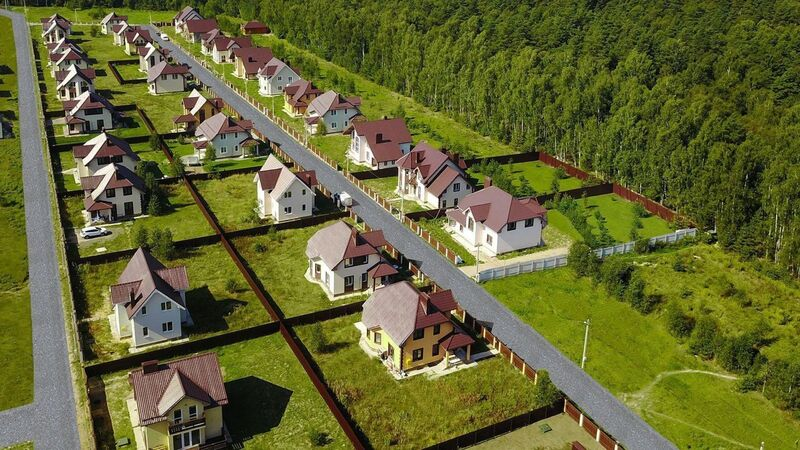
                                

                                

                                    
                                

                                

                                    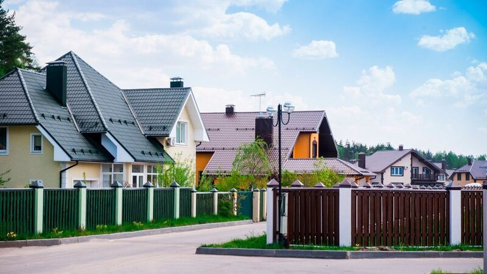
                                

                                

                                    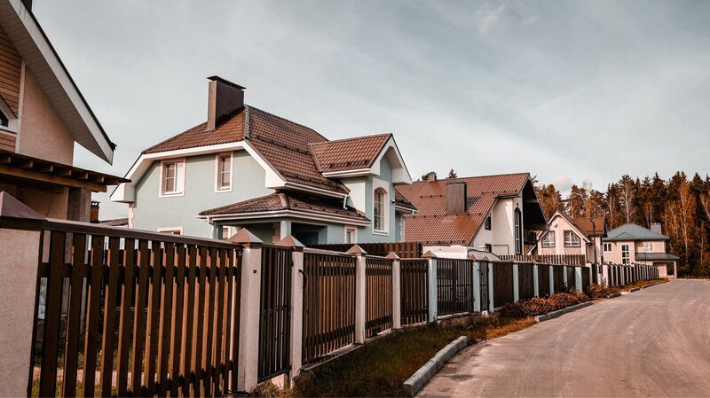
                                

                                

                                    
                                

                            

                            

                           
                        

                        

                            

                                

                                    <a href="#">
                                        ЖК «Буковая аллея»
                                    </a>
                                

                                

                                    <a href="#">
                                        МО, Богородский ГО, д. «Кабаново»
                                    </a>
                                

                                <ul class="villages__content-list">
                                    <li>
                                        <a href="#" class="villages__content-link">
                                            Монинское шоссе
                                        </a>
                                    </li>
                                    <li>
                                        <a href="#" class="villages__content-link">
                                            30 км от МКАД
                                        </a>
                                    </li>
                                </ul>
                            

                            

                                

                                    
                                    
4.9

                                

                                

                                    
                                    
250 отзывов

                                

                            

                        

                        

                            
Свободные участки 1/71

                        

                    

                    

                        

                            

                                

                                    
                                

                                

                                    
                                

                                

                                    
                                

                                

                                    
                                

                                

                                    
                                

                            

                            

                        

                        

                            

                                

                                    <a href="#">
                                        ЖК «Воскресенское»
                                    </a>
                                

                                

                                    <a href="#">
                                        МО, Богородский ГО, с. Воскресеское
                                    </a>
                                

                                <ul class="villages__content-list">
                                    <li>
                                        <a href="#" class="villages__content-link">
                                            Щёлковское шоссе
                                        </a>
                                    </li>
                                    <li>
                                        <a href="#" class="villages__content-link">
                                            30 км от МКАД
                                        </a>
                                    </li>
                                </ul>
                            

                            

                                

                                    
                                    
5.0

                                

                                

                                    
                                    
1380 отзывов

                                

                            

                        

                        

                            
                            
Полностью реализован

                        

                    

                    

                        

                            

                                

                                    
                                

                                

                                    
                                

                                

                                    
                                

                                

                                    
                                

                                

                                    
                                

                            

                            

                        

                        

                            

                                

                                    <a href="#">
                                        ЖК «Полесье»
                                    </a>
                                

                                

                                    <a href="#">
                                        МО, Богородский ГО, д. «Кабаново»
                                    </a>
                                

                                <ul class="villages__content-list">
                                    <li>
                                        <a href="#" class="villages__content-link">
                                            Монинское шоссе
                                        </a>
                                    </li>
                                    <li>
                                        <a href="#" class="villages__content-link">
                                            30 км от МКАД
                                        </a>
                                    </li>
                                </ul>
                            

                            

                                

                                    
                                    
4.8

                                

                                

                                    
                                    
85 отзывов

                                

                            

                        

                        

                            
                            
Полностью реализован

                        

                    

                    

                        

                            

                                

                                    
                                

                                

                                    
                                

                                

                                    
                                

                                

                                    
                                

                                

                                    
                                

                            

                            

                        

                        

                            

                                

                                    <a href="#">
                                        ЖК «Воскресенское-2»
                                    </a>
                                

                                

                                    <a href="#">
                                        МО, Богородский ГО, с. Воскресеское
                                    </a>
                                

                                <ul class="villages__content-list">
                                    <li>
                                        <a href="#" class="villages__content-link">
                                            Щёлковское шоссе
                                        </a>
                                    </li>
                                    <li>
                                        <a href="#" class="villages__content-link">
                                            30 км от МКАД
                                        </a>
                                    </li>
                                </ul>
                            

                            

                                

                                    
                                    
4.9

                                

                                

                                    
                                    
945 отзывов

                                

                            

                        

                        

                            
Свободные участки 126/421

                        

                    

                    

                        

                            

                                

                                    
                                

                                

                                    
                                

                                

                                    
                                

                                

                                    
                                

                                

                                    
                                

                            

                            

                        

                        

                            

                                

                                    <a href="#">
                                        КП «Родинки»
                                    </a>
                                

                                

                                    <a href="#">
                                        МО, Богородский ГО, д. «Новая Купавна»
                                    </a>
                                

                                <ul class="villages__content-list">
                                    <li>
                                        <a href="#" class="villages__content-link">
                                            Монинское шоссе
                                        </a>
                                    </li>
                                    <li>
                                        <a href="#" class="villages__content-link">
                                            30 км от МКАД
                                        </a>
                                    </li>
                                </ul>
                            

                            

                                

                                    
                                    
4.8

                                

                                

                                    
                                    
85 отзывов

                                

                            

                        

                        

                            
Свободные участки 12/13

                        

                    

                    

                        

                            

                                

                                    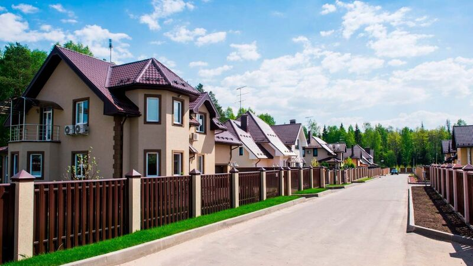
                                

                                

                                    
                                

                                

                                    
                                

                                

                                    
                                

                                

                                    
                                

                            

                            

                        

                        

                            

                                

                                    <a href="#">
                                        ЖК «Новое Воскресенское»
                                    </a>
                                

                                

                                    <a href="#">
                                        МО, Богородский ГО, с. Воскресеское
                                    </a>
                                

                                <ul class="villages__content-list">
                                    <li>
                                        <a href="#" class="villages__content-link">
                                            Щёлковское шоссе
                                        </a>
                                    </li>
                                    <li>
                                        <a href="#" class="villages__content-link">
                                            30 км от МКАД
                                        </a>
                                    </li>
                                </ul>
                            

                            

                                

                                    
                                    
4.9

                                

                                

                                    
                                    
945 отзывов

                                

                            

                        

                        

                            
Свободные участки 364/521

                        

                    

                

                <a class="privileges__link catalogHome-privileges__link" href="#">
                    Расчитать стоимость
                    
                </a>
            

        </section>

        <!-- purchaseOptions -->
        <section class="purchaseOptions">
            

                <h2 class="section-title purchaseOptions-title">
                    Варианты приобретения
                </h2>
                

                    

                        

                            

                                

                                    01
                                

                            

                            <h3 class="purchaseOptions__card-title">
                                Рассрочка от застройщика
                            </h3>
                            

                                Улучшить свои жилищные условия стало намного проще с возможностью приобретения участка или готового дома на более выгодных условиях.
                            

                            

                                Вы можете воспользоваться беспроцентной рассрочкой на период от 3 до 12 месяцев:
                            

                            <ul class="purchaseOptions__card-list">
                                <li class="purchaseOptions__card-item">
                                    <svg width="18" height="18" viewBox="0 0 18 18" fill="none" xmlns="http://www.w3.org/2000/svg">
                                        <circle cx="9" cy="9" r="9" fill="white"/>
                                        <path d="M12.1501 6.75L8.1001 11.25L5.8501 9.45" stroke="#005AA3" stroke-width="1.5" stroke-linecap="round" stroke-linejoin="round"/>
                                    </svg>
                                    

                                        Рассрочка на участки без подряда ― 3-6 мес.
                                    
                                    
                                </li>
                                <li class="purchaseOptions__card-item">
                                    <svg width="18" height="18" viewBox="0 0 18 18" fill="none" xmlns="http://www.w3.org/2000/svg">
                                        <circle cx="9" cy="9" r="9" fill="white"/>
                                        <path d="M12.1501 6.75L8.1001 11.25L5.8501 9.45" stroke="#005AA3" stroke-width="1.5" stroke-linecap="round" stroke-linejoin="round"/>
                                    </svg>
                                    

                                        Рассрочка на готовые дома ― 3-6 мес.
                                    
                                    
                                </li>
                                <li class="purchaseOptions__card-item">
                                    <svg width="18" height="18" viewBox="0 0 18 18" fill="none" xmlns="http://www.w3.org/2000/svg">
                                        <circle cx="9" cy="9" r="9" fill="white"/>
                                        <path d="M12.1501 6.75L8.1001 11.25L5.8501 9.45" stroke="#005AA3" stroke-width="1.5" stroke-linecap="round" stroke-linejoin="round"/>
                                    </svg>
                                    

                                        Рассрочка на строительство дома ― 6-12 мес.
                                    
                                    
                                </li>
                            </ul>
                        

                        

                            

                                

                                    02
                                

                            

                            <h3 class="purchaseOptions__card-title">
                                Ипотека
                            </h3>
                            

                                Это самый распространённый вариант для получения современного жилья под ключ уже сегодня. Вам не придётся лично посещать банк! Наши квалифицированные специалисты имеют огромный опыт в сфере ипотечного кредитования. Они помогут Вам не только отправить заявку и получить одобрение кредита, но и осуществят комплексное сопровождение сделки.
                            

                        

                        

                            

                                

                                    03
                                

                            

                            <h3 class="purchaseOptions__card-title">
                                100% оплата
                            </h3>
                            

                                При выборе полной оплаты Вы получаете ряд преимуществ: покупка недвижимости на индивидуальных финансовых условиях, простое оформление документов и ускоренное прохождение сделки
                            

                        

                        

                            

                                

                                    04
                                

                            

                            <h3 class="purchaseOptions__card-title">
                                Материнский капитал
                            </h3>
                            

                                Большое распространение получило использование государственного сертификата материнского (семейного) капитала для покупки современного жилья в нашем коттеджном посёлке. Данный сертификат возможно использовать для погашения ипотечных платежей.
                            

                        

                    

                

            

        </section>

        <section class="reviews-residents">
            

                

                    

                        <h2 class="section-title">Отзывы жильцов</h2>
                        

                            

                                
                            

                            

                                
                            

                        

                    

                    

                        

                            

                                

                                    

                                        ★★★★★
                                    

                                    

                                        Сейчас мы живем в поселке Воскресенское. Здесь есть все, что нужно для
                                        нормальной жизни – аптека, магазин,
                                        школа, а также больница. Есть место, отведенное под детскую площадку. Соседи
                                        у нас тоже хорошие. Конечно, из-за
                                        ситуации с пандемией не получается часто общаться. Люди стараются больше
                                        дома сидеть. Да и дело идет к зиме.
                                        Надеюсь, что первая зима в поселке пройдет хорошо :)
                                    

                                    

                                        
                                        

                                            
Софья Ёлкина

                                            <time class="review__author-date" datetime="2020-10-05">05.10.2020</time>
                                        

                                    

                                

                            

                            

                                

                                    

                                        ★★★★★
                                    

                                    

                                        Замечательный комплекс недалеко от Москвы. Сосновый лес, пруд на территории
                                        комплекса. Дома предлагаются к продаже с
                                        отделкой. Сроки строительства от момента заключения сделки 9 месяцев , скорее
                                        всего индивидуально. Есть участки как с
                                        подрядом так и без подряда. Газ в доме, электричество, вода, септик. Заезжай и
                                        живи. Думаю о покупке одноэтажного дома
                                        (мне больше не надо)
                                    

                                    

                                        
                                        

                                            
Елена Максимова

                                            <time class="review__author-date" datetime="2021-05-03">03.05.2021</time>
                                        

                                    

                                

                            

                            

                                

                                    

                                        ★★★★★
                                    

                                    

                                        Место прекрасное, тихое, летом прохладно, сказывается наличие рядом озер, и
                                        сосновый лес. По вечерам слышен колокольный
                                        звон с ближайшего монастыря, что дает неплохой бонус к настроению. Тут
                                        отдыхаешь, это про хорошее. Касательно плохого,
                                        есть пару вопросов к застройщику касательно инфраструктуры. В целом все хорошо!
                                    

                                    

                                        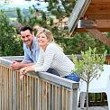
                                        

                                            
Никита М.

                                            <time class="review__author-date" datetime="2021-10-04">04.10.2021</time>
                                        

                                    

                                

                            

                            

                                

                                    

                                        ★★★★★
                                    

                                    

                                        Место2 прекрасное, тихое, летом прохладно, сказывается наличие рядом озер, и
                                        сосновый лес. По вечерам слышен
                                        колокольный
                                        звон с ближайшего монастыря, что дает неплохой бонус к настроению. Тут
                                        отдыхаешь, это про хорошее. Касательно
                                        плохого,
                                        есть пару вопросов к застройщику касательно инфраструктуры. В целом все хорошо!
                                    

                                    

                                        
                                        

                                            
Никита М.

                                            <time class="review__author-date" datetime="2021-10-04">04.10.2021</time>
                                        

                                    

                                

                            

                        

                    

                

            

        </section>

        

            

                <h2 class="map__title">Наши посёлки на карте</h2>
            

            

                

            

            

                

                    

                        

                            

                                
                            

                            

                                
                            

                            

                                
                            

                            

                                
                            

                            

                                
                            

                        

                        

                    

                    

                        

                            

                                <a href="#">
                                    ЖК «Буковая аллея»
                                </a>
                            

                            

                                <a href="#">
                                    МО, Богородский ГО, д. «Кабаново»
                                </a>
                            

                            <ul class="villages__content-list">
                                <li>
                                    <a href="#" class="villages__content-link">
                                        Монинское шоссе
                                    </a>
                                </li>
                                <li>
                                    <a href="#" class="villages__content-link">
                                        30 км от МКАД
                                    </a>
                                </li>
                            </ul>
                        

                        

                            

                                
                                
4.9

                            

                            

                                
                                
250 отзывов

                            

                        

                    

                    

                        
Свободные участки 1/71

                    

                

            

        

        <section class="bid-2">
            

                
Приезжайте на экскурсию
                    по нашим посёлкам

                

                    

                        
Экскурсия по коттеджному поселку – это отличный способ узнать о
                            возможностях проживания в будущем доме или даче,
                            познакомиться с инфраструктурой и особенностями местности, а также почувствовать единство с
                            природой.

                        

                            

                                <a class="communication__social-link" href="#">
                                    
                                </a>
                                <a class="communication__social-link" href="#">
                                    
                                </a>
                            

                            <a class="phone" href="tel:+74957977071">
                                +7 495 797 70 71
                            </a>
                        

                    

                    <form class="bid__form" action="#">
                        

                            <input class="form-item" type="text" placeholder="Имя" required>
                            <input class="form-item" type="tel" placeholder="Телефон" required>
                        

                        

                            <label class="checkbox">
                                <input class="checkmark" type="checkbox" checked required>
                                
                                Согласен (-на) c <a href="#">политикой конфиденциальности</a>
                            </label>
                            <button class="bid-form__btn" type="submit">
                                Записаться на экскурсию
                                
                            </button>
                        

                    </form>
                

            

        </section>

        <section class="latest-news">
            

                

                    

                        <h2 class="section-title">Последние новости</h2>
                        

                            

                                
                            

                            

                                
                            

                        

                    

                    

                        

                            

                                

                                    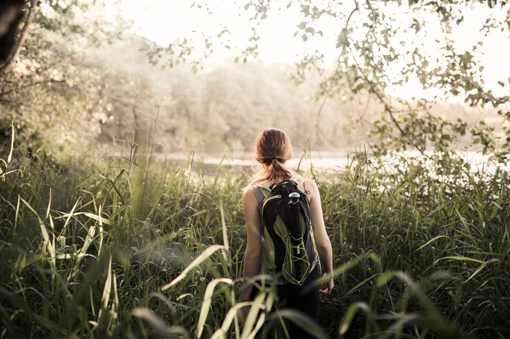
                                    

                                        

                                            Жизнь в гармонии с природой
                                        

                                        

                                            Представляем вашему вниманию уютный коттеджный посёлок, окружённый лесом и
                                            расположенный рядом с рекой и так далее по тексту
                                        

                                        <time class="latest-new__date" datetime="2024-02-04">04.02.2024</time>
                                    

                                

                            

                            

                                

                                    
                                    

                                        

                                            Новый уровень комфорта
                                        

                                        

                                            Представляем вам новый коттеджный посёлок, где каждый дом оснащён системой
                                            умного дома и так далее по тексту
                                        

                                        <time class="latest-new__date" datetime="2024-06-05">05.06.2024</time>
                                    

                                

                            

                            

                                

                                    
                                    

                                        

                                            ЖК «Буковая аллея»
                                        

                                        

                                            Закрытый посёлок, окружённый лесом, предлагает комфортабельные дома с
                                            участками от 10 соток и так далее по тексту, что не вмещается
                                        

                                        <time class="latest-new__date" datetime="2024-10-12">12.10.2024</time>
                                    

                                

                            

                            

                                

                                    
                                    

                                        

                                            Жизнь в гармонии с природой
                                        

                                        

                                            Lorem, ipsum dolor sit amet consectetur adipisicing elit. Cumque veritatis
                                            quam repellat commodi reprehenderit accusamus at aperiam nihil iste a ipsum,
                                            libero cupiditate recusandae sapiente. Esse veritatis officia sit libero?
                                        

                                        <time class="latest-new__date" datetime="2024-02-04">04.02.2024</time>
                                    

                                

                            

                        

                    

                

            

        </section>

        <section class="our-contacts">
            

                <h2 class="section-title">
                    Наши контакты
                </h2>

                

                    

                        

                            

                                
                                
Телефон

                            

                            <a class="connect" href="tel:+74957977071">
                                +7 (495) 797 70 71
                            </a>
                            

                                Ежедневно с 10 до 19
                            

                        

                        

                            

                                
                                
E-mail

                            

                            <a class="connect" href="mailto:info@cottage-poselki.com">
                                info@cottage-poselki.com
                            </a>
                            

                                По всем вопросам
                            

                        

                        

                            

                                
                                
Соц.сети

                            

                            

                                Следите за нами в социальных сетях
                            

                            

                                <a class="contacts__social-link" href="#">
                                    
                                </a>
                                <a class="contacts__social-link" href="#">
                                    
                                </a>
                                <a class="contacts__social-link" href="#">
                                    
                                </a>
                                <a class="contacts__social-link" href="#">
                                    
                                </a>
                            

                        

                    

                    

                        

                            

                                
                                
Адрес

                            

                            <address class="сontact-text-address">
                                Московская область, Щелковское шоссе, Горьковское шоссе, 30 км от МКАД
                            </address>
                        

                        

                            
                            <a class="route__link" href="#">Построить маршрут</a>
                        

                    

                

            

        </section>

    </main>

    <footer class="footer">
        

            

                

                    

                        

                        
                        
© 2007 – 2024 COTTAGE POSELKI

                    

                    <nav class="footer__menu">
                        <ul class="footer__menu-list">
                            <li class="footer__menu-item">
                                
Навигация

                            </li>
                            <li class="footer__menu-item">
                                <a href="#" class="footer__menu-link">Главная</a>
                            </li>
                            <li class="footer__menu-item">
                                <a href="#" class="footer__menu-link">Коттеджи</a>
                            </li>
                            <li class="footer__menu-item">
                                <a href="#" class="footer__menu-link">Генплан</a>
                            </li>
                            <li class="footer__menu-item">
                                <a href="#" class="footer__menu-link">Видео-обзоры</a>
                            </li>
                            <li class="footer__menu-item">
                                <a href="#" class="footer__menu-link">Отзывы</a>
                            </li>
                            <li class="footer__menu-item">
                                <a href="#" class="footer__menu-link">Контакты</a>
                            </li>
                        </ul>
                        <ul class="footer__menu-list">
                            <li class="footer__menu-item">
                                
Посёлки

                            </li>
                            <li class="footer__menu-item">
                                <a href="#" class="footer__menu-link">Новое Воскресенское</a>
                            </li>
                            <li class="footer__menu-item">
                                <a href="#" class="footer__menu-link">Воскресенское-2</a>
                            </li>
                            <li class="footer__menu-item">
                                <a href="#" class="footer__menu-link">Воскресенское</a>
                            </li>
                            <li class="footer__menu-item">
                                <a href="#" class="footer__menu-link">Буковая аллея</a>
                            </li>
                            <li class="footer__menu-item">
                                <a href="#" class="footer__menu-link">Полесье</a>
                            </li>
                            <li class="footer__menu-item">
                                <a href="#" class="footer__menu-link">Родинки</a>
                            </li>
                        </ul>
                    </nav>
                

                

                    <nav class="footer__menu footer__menu-bottom">
                        <ul class="footer__menu-list footer__menu-list-mob">
                            <li class="footer__menu-item">
                                <a href="#" class="footer__menu-link footer__menu-link-mob">Построить маршрут</a>
                            </li>
                        </ul>
                        <ul class="footer__menu-list">
                            <li class="footer__menu-item">
                                <a href="#" class="footer__menu-link">Политика конфиденциальности</a>
                            </li>
                        </ul>
                    </nav>
                    

                        
Информация на сайте не является публичной офертой

                    

                    
                

            

        

    </footer>

    
    
    
    
</body>

</html>
